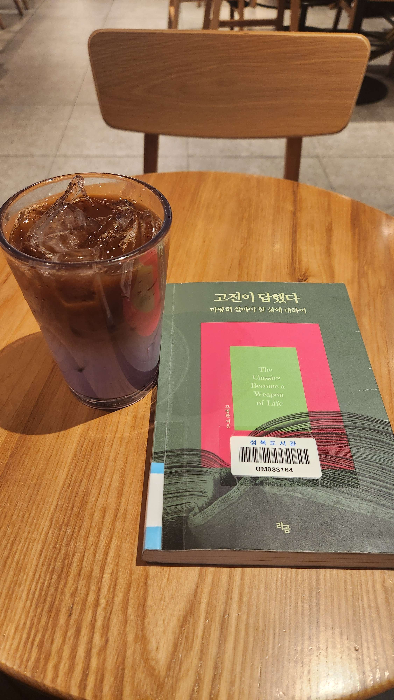
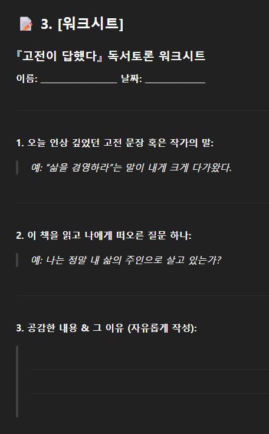
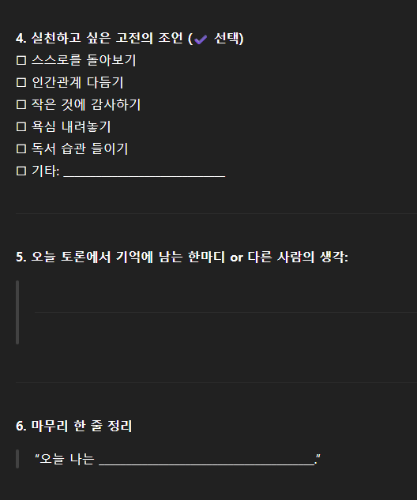

# 책-선정/250609 고전이 답했다 마땅히 살아야 할 삶에 대하여

### [2025-07-04T02:41:50.596000+00:00] pappasco
작가 : 고명환

### [2025-07-04T02:45:40.124000+00:00] pappasco
첫 도서

### [2025-07-07T08:06:51.090000+00:00] pappasco
# 06/09

챕터2개 돌아가면서 읽음
느낀점 : 생각하게 하는 힘 불어 넣음

### [2025-07-07T08:08:52.094000+00:00] pappasco
# 06/16

본거 - 
p.57 삶은 결핍과 고통으로 튼흔하게 엮자.
결핍이 만족은 낳아

깨달음 - 
부족함을 느껴야함.
풍요로움 누리는것 만 생각함

적용 - 
풍요로음보다 부족한것 찾기
갖고있는것을 쓸 생각보다 나에게 부족한 것을 채우기

### [2025-07-07T08:12:17.888000+00:00] pappasco
# 06/23

본거 - 
사실 죽음은 어떤 순간에나 우리와 함께 있다.
단지 견디기만 하는것이 아니다. 사랑하는 것이다.

깨달음 - 
그동안 죽는다고 생각하고 산게 아닐까.
러닝10키로 대회에서 기절했었던 과거 후 죽음을 피하는 삶을 산것이라 느낌.

적용 - 
피하려고 하는 직업탐색
컴퓨터에 앉아 해야할것들 취업관련사이트 켜놓고 앉아있기만 하기

[[숙제]] 비전선언문 : 
성실하게 내일을 해나가는 영상제작자가 되겠다.
만날수 있는 사람과 여유롭게 만나는 삶을 살겠다.

### [2025-07-07T08:19:26.024000+00:00] pappasco
# 06/30

본거 - 
햄릿 -- 성공비결은 그냥 '문득' 시작
시작함-> 좋음을 느낌 -> 확신이 생김 -> 차분한 상태서 결심
고명환 저자의 아침긍정학원 1308일 돌파
결심은 미래로 도망치는것.
지금 하고싶지 않아서 결심하는것.

깨달음 -
그동안 수많은 결심이 실패했던 이유를 알게됨

적용 - 
건설적인 생각이 들면 미루지 않고 바로 시작함
컴퓨터에 앉아 해야할것들 취업관련사이트 켜놓고 앉아있기만 하기
실제로 요근래에 진행한 내용이 제일 진도 많이나감.

[[숙제]] 인생책 찾기 :
책 : 마음밭에 무얼심지?
이유 : 중학교 학교도서관 도서위원 시절에 많은 깨달음을 주었음.

### [2025-09-02T15:50:00.559000+00:00] pappasco
6/9 워크시트 답변 보충

1. 사람들은 '2+2=4'라고 가르친다고 교사에게 찬사를 보내지 않는다. ... [페스트] 168쪽
2. 자기 자신의 목소리를 좀 더 쉽게 들을수 있는 방법이 있을까.
3. 진정 내가 원하는 삶으로 변신하자. - 실제로 인생의 가치관이 고명환 저자님처럼 멈춤을 겪은 경험이 있어 비슷한 마인드를 마음에 두고 있어 이 인생관에 공감함.
4. 독서 습관 들이기
5. 고명환 저자의 말을 곧이곧대로 받아들이지 않기
6. 오늘 나는 그동안의 개념에 의존하지 않고 직관을 살리자. 말의 의미를 잘 이해하도록 노력하자.

### [2025-12-21T14:55:27.544000+00:00] pappasco
250609 고전이 답했다 마땅히 살아야 할 삶에 대하여