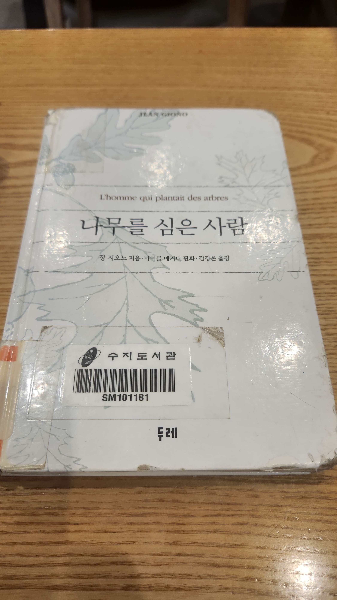

# 책-선정/250707 나무를 심은 사람

### [2025-07-04T02:45:05.452000+00:00] pappasco
작가 : 장 지오노

### [2025-07-04T02:46:16.870000+00:00] pappasco
#인생책

### [2025-07-04T02:46:38.830000+00:00] pappasco
나무를 심은 사람 #인생책

### [2025-07-04T02:48:26.521000+00:00] pappasco
나무를 심은 사람

### [2025-07-04T03:11:50.034000+00:00] pappasco
추천자 : 신민철

### [2025-07-07T12:55:39.554000+00:00] pappasco
# 07/07

1 -
  본거 : 
지명 어려움
지역 묘사 머리에 안들여화서 시작할때 손이안갔었음
(나무 심는 부분부터 흥미 생김)
  깨달음 :
초반에 시도하고 어려워서 포기한 일들 생각남.
재미 포인트를 만나기 위해 조금 견뎌보자
  적용: 
카뮈 이방인 / 피를 마시는 새 읽기 시작

2 - 
  본거 : 
10만개 심어서 1만그무 남음
1만 단풍나무 모두 죽은 일 있음 ->더 잘자라는 너도 밤나무
  깨달음 :
내가 도토리 10만개 심은 적이 있던가
달리기 1년 꾸준히 해도 찾지 못함.
행복해 질 수 있는 멋진 방법 찾음.
  적용 : 
행복해 질수 있는 멋진방법 뭘까 고민

3 - 
  본거 : 
산림감시원의 순진한 불피우지 말라는 경고
나의 친구 (산림전문가)
가치 있는 것을 알아볼줄 알았고 입을 다물줄도 알았다.
이곳의 토양에 알맞을것 같은 몇몇 나무의 종류에 관해 짧게 알려주었다. 그러나 그것은 고집하지 않았다.
  깨달음 : 
이런 사람이 되고싶다. 순진한 마음이더라도 나만의 생각으로 남을 규제하지 말자.
  적용 :
나의 관심사와 관련있는 (산림전문가 같은) 사람과  이야기 해보기
서경진 - 달리기 하신다는데 연락해보기 이번주내로 

[[숙제]] 작가가 나에게 하는 말 한줄문장 → 행복해 질수 있는 멋진 방법 10만개 있의 너도 찾길 바래
이유 -- 
나무로 심는 이유가 명확히 나오지 않고 글이 진행됨
나중에 나의 친구의 말이 나옴. "그는 나무에 대해 누구보다 많이 알아. 그는 행복해질 수 있는 멋진 방법을 찾은 사람이야"
행복해 질수 있는 방법은 엘제아르 부피에가 심은 도토리 10만개에 심겨져 있는게 아닐까? 라고 작가가 이야기 한다고 생각했음

### [2025-07-08T09:57:23.486000+00:00] pappasco
https://youtu.be/gx5He0CsnAE

### [2025-07-08T09:57:47.801000+00:00] pappasco
이 디스코드 서버도 큰 숲이 되길

### [2025-12-21T14:56:06.504000+00:00] pappasco
250707 나무를 심은 사람