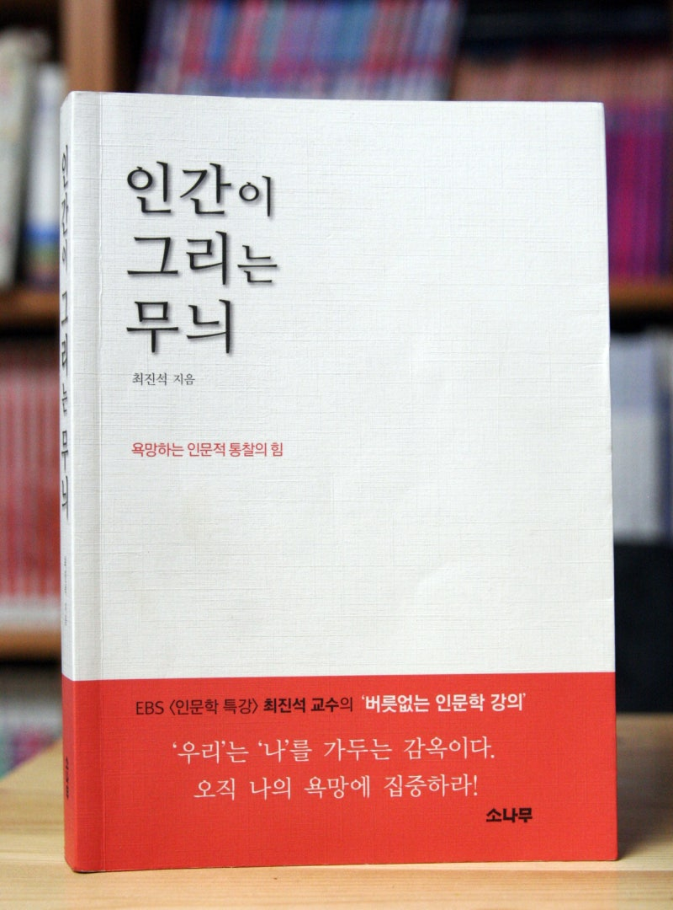

# 책-선정/250717 인간이 그리는 무늬

### [2025-07-04T03:06:32.052000+00:00] pappasco
작가 : 최진석

### [2025-07-04T03:12:05.558000+00:00] pappasco
추천자 : 이보식

### [2025-07-17T13:33:46.102000+00:00] pappasco
# 07/17
챕터 1 감상

책이 어려웠어서 여러번 쉬면서, 생각하면서 읽었다.
정중함이 느껴짐.
추론하는 과정이 논리적이라 조금씩 궁금함을 자아내면서 읽게됨.
왜 보식 님께서 인생책이라고 칭했는지 알거같다. 

본깨적

1
인문.->무늬 동선.
뮤지컬 영화 좋아하는데 좋아하는 이유 중 하나가 무늬,동선이 보여져서 아닐까?
인문 관련 작품 찾기 / 도덕경 궁금하다.

2
뭐뭐한 것 같아요.(추측) 가능한건지 독자에게 물어봄. ‘우리’은 나를 가두는 감옥. 벗어난다는 말 -> 온전한 ‘나’ 남음
명상하면서 항상 신념, 이념, 가치과 비우고 온전한 나 찾으면서 개운하고 하루를 의욕적으로 살게 됨.
더 즐겁게 명상하게됨.

3
저는 오직 나에게만 있는 고유한 충동, 힘, 의지, 활동성, 비정형성의 감각 -> 욕망이라 부름.
욕망 안 좋게만 생각하고 억눌러 왔음.
생각해오던 이념 사명 무엇인가 찾기.

### [2025-07-25T02:04:42.344000+00:00] pappasco
# 07/24

챕터2 

본깨적

페이지 111 - 자기 자신을 믿고, 스스로를 긍정해야 합니다. 잘나고 좋은모습 + 못나고 일그러지고 추한 모습 - 함께 긍정하고 사랑해야합니다.
문득 내가 했던 과거일 행동 말 부끄러움.
모든 나를 사랑하자.

페이지 139, 140 - 노자는 조직을 작은 단위로 운영해야한다고 말함. 오늘날 많은 거대 조직들이 중앙 집권보다는 분산형 팀제로 조직 관리를 합니다.
나는 어떤 조직으로 들어가야 하는가? 조직을 찾지못하면 결국 고립되는 것 아닌가?
답변 찾아가는 중.

### [2025-08-07T12:33:14.944000+00:00] pappasco
**발문 답변 추가**

🌱 [숨 독서 모임 – 토론 주제 제안]
1. 나는 누구의 기대에 맞추어 살고 있는가?
나 자신의 욕망에 부응하려 노력함

2. ‘나답게 산다’는 건 무슨 뜻일까?
내가 가진 욕망을 철저히 알아채고 뚝심있게 이뤄냄

3. 익숙함을 깨고 새로운 방향으로 나아가려면 어떻게 해야 할까?
모든것을 비운 나를 만나야한다

4. 자유롭게 산다는 건 어떤 삶을 말하는 걸까?
고난,역경에 적응하여 뜻한바를 향해 나아가는 삶

5. 내 삶을 나만의 문장으로 표현 한다면 어떤 문장이 될까?
끊임없이 새로워지기를 열망하는 나무

이 주제를 가지고.
다음 주에 각자의 삶과 사유를 성찰하고 토론하여 나무를 심는 사람처럼 조용한 실천으로 이어지는 우리가되었으면 좋겠습니다.

### [2025-08-07T12:34:21.785000+00:00] pappasco
# 07/31 
불참

### [2025-08-07T12:36:21.034000+00:00] pappasco
# 08/07
대학시절 토론 사회자 역할
주제바꿔서 왜 여러분들은 질문하지않는가

소로우의 글
봄날이 가고있다는것을 - 어두운면을 직시하라
피하지않고 해볼게요
인생은 길고 젊음은 짧다

여행갔을때 어색한친구
무슨생각하니 
뭐하고싶니 너의욕망은 무엇이니

책내용이 굉장히 방대했다. 다읽고 벅차오름을 느낌.
가을이 되었을때 또 읽어봐야겠다.

### [2025-08-07T14:34:11.423000+00:00] pappasco
덕이란 무엇일까 정리덜됨. 물어볼려 그랬는데 까먹었다.

### [2025-12-21T14:56:32.194000+00:00] pappasco
250717 인간이 그리는 무늬