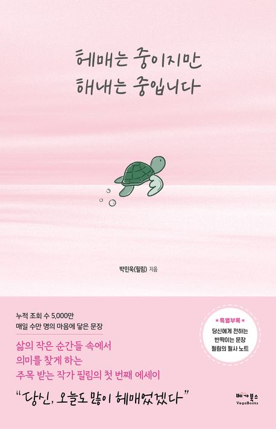

# 책-선정/250925 (개인책) 헤매는 중이지만 해내는 중입니다

### [2025-09-25T12:23:54.904000+00:00] pappasco
박민욱(필림)

자유책 선정자 : 문준위

### [2025-09-25T12:24:03.595000+00:00] pappasco
# 09/25

이제 슬슬 적응이됨. 속도조절 해나가는중

6월 27일 책구매. 손글씨 강좌가 있나 싶어 클래스101 을 찾아보는데 손글씨 강사님이 쓴 에세이 제목이 굉장히 눈길을 당겨서 사게됐다.

따뜻한 에세이. 길치인 입장에서 인생을 헤메는 과정과 그에 대한 위로를 글로 녹여내 주어서 인상 깊었습니다.

힘들 때마다 한 chapter씩 읽으면 다음에 마음 안정을 가져올 수 있는 책이다.

작가의 성격이 나랑 비슷해서 굉장히 공감도 많이 했다.

이번주 일요일까지 SA를 써야 되는데 굉장히 에세이의 방향성을 정할 수 있어서 유익했다.

202 페이지 끙끙거리고 감정소비 할 가치가 있는 사람이 아니라면 소중한 사람 한 번 더 챙기는 걸로 합시다. 한그릇 물러나서 떠올려보는 겁니다. 정말 내가 저 사람 때문에 마음 상할 필요가 있는지.

나도 맺고 끊음에 있어. 어려움을 많이 겪는 사람인데 이 말이 참 공감이 많이 됐다. 한걸음 물러나 보는게 참 좋은 생각이다.

221 페이지 이 정도면 충분히 표현했다. 이런 위험한 생각을 할 시간에 말로 전하자 말로.

평소 발로 편하지 않고 홱 돌아서기 일수였는데 내가 말하지 않고 넘어간 경우가 꽤 있지 않았을까라는 생각이 든다

240 페이지 내려놓는 것은 끊어내는 것이 아니라 마음 한구석에 자리 내어주고 들여다보지 않으려 애쓰는 것이었지.

생각해보면 끊어낸다고 해도 나중에 생각나는 게 사람 이 아닌가 싶다. 너무 끊어내려고 생각하지 않아야겠다.

맹상군 열전

기본적으로 살짝 익기 쉽지는 않았다.

주변에 좋은 사람들을 갖고 있다는 것에 대해 너무 부러웠다. 사람 자체도 똑똑한 사람이니까 이렇게 사람이 모인다라는 느낌도 있고.

맹상군이 다른 사람의 의견을 들었을 때 크게 무시하지 않고 들어주는 자세가 아주 좋았다.

진행자는 책을 발표해야함.

진행자 순서는 인설→보식→민철→준위→성희 순

진행자가 페이스톡 시작할 것

### [2025-09-25T13:10:09.029000+00:00] pappasco
혼자 즐기는것 인스턴트 음식
같이 즐기는것 된장찌개 김치찜

좋은걸 같이 즐기고 싶어지는중

### [2025-09-26T02:44:09.758000+00:00] pappasco
생각해봐도 할 말은 하는게 나중에 후회가 없더라

### [2025-12-21T12:21:16.131000+00:00] pappasco
(개인책) 헤매는 중이지만 해내는 중입니다

### [2025-12-21T15:02:12.830000+00:00] pappasco
250925 (개인책) 헤매는 중이지만 해내는 중입니다

### [2025-12-28T13:05:16.600000+00:00] pappasco
다른 회원님들 선정책
📖 변인설 : <상식을 깨부숴라> 사이토 히토리 저
📖 이보식 : <행동력 수업> 오현호 저
📖 신민철 : <고수의 생각법> 조훈현 저

차기 도서는 투표를 통해 '상식을 깨부숴라' 로 선정