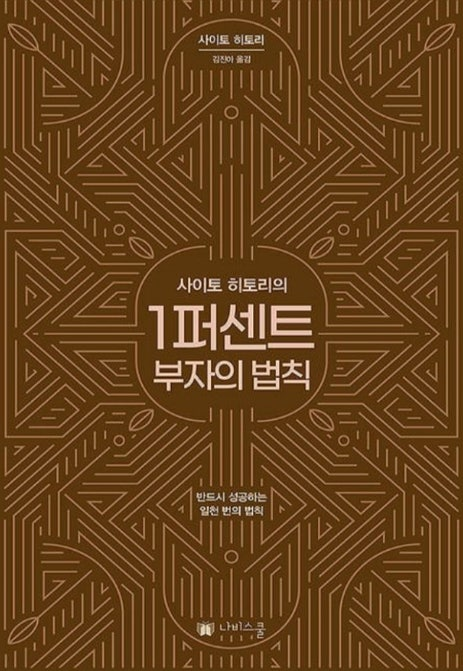

# 책-선정/251016 1퍼센트 부자의 법칙

### [2025-10-16T12:13:01.553000+00:00] pappasco
사이토 히토리

### [2025-10-16T12:13:12.566000+00:00] pappasco
# 10/16

오 나는 참 행복해

못할 것도 없지.

난 참 풍족해

앞으로 종종 되내어볼 것 같다.

매일 마음을 열고 산다면 운이 좋아진다 라는 걸 깨달았고 확실히 도움이 될 것 같다

달리기 할때 운이 좋기를 못할것도 없지를 되내으면서 달리기 10km 에 성공했다.

참 세상 살기 편하게 산다는 걸 깨달았는데
나도 세상 살기 편하게 살면 되는 거 아닌가?

발췌

--ch1 뒤쪽 부분 노력과 성공의 관계

잘못된 노력. 나와 다른 해석을 내려서 갸우뚱함. 물론 너무 많은 노력을 하게 되면 힘이 들어가서 자연스러워져야 한다는 것 동의. 

노력과 운은 연관관계가 없다 라는 말은 그렇게 공감하진 못했다.
힘든 일을 하는 이유는 그 너머에 내가 하고 싶은 일이 있기 때문이라고 생각한다.

2챕터 부부의 숙명 

있는 그대로 이 사람을 사랑해보자. 

요즘 깨달은 것 반갑다.

--챕터4가 가장 부의 사고방식에 대해 설명 잘되어있었다.

--ch4 최종 목표를 말하지 마라

자신의 갈망을 꾹꾹 눌러 담아 마음속에 품고 있으면 머지않아 엄청난 기세로 분출됩니다.

나는 표현해야 이뤄진다고 믿었다. 난 그동안 내 갈망들을 표현하기에 급급했던 것 같다. 그동안 추진력 부족했던게 아닐까. 부자가 되기 위해 끝꾹 둘러 담아 봐야겠다

ch5 열심히 일하면

남성이 적극성을 쏟아부어야 할 곳은 바로 자신의 일입니다. 

지금 내가 필요한 것  

--5챕터 실패하는 즐거움 

사람은 항상 22프로의 개선점을 남기고 다음 단계로 나아갑니다. 한 가지 개선점을 고치고 나면 22%의 개선점이 또 남기 때문입니다. 그런데 이걸 반복하다 보면 개선해야 할 부분이 점점 작아집니다. 이것이 바로 78 프로의 법칙입니다.

사람은 완벽할수 없다. 제세공과금 22프로 생각남.

### [2025-10-21T09:57:49.195000+00:00] pappasco
노력하지말고 자연스럽게 하기

### [2025-12-21T14:59:29.820000+00:00] pappasco
251016 퍼센트 부자의 법칙

### [2025-12-21T14:59:46.049000+00:00] pappasco
251016 1퍼센트 부자의 법칙