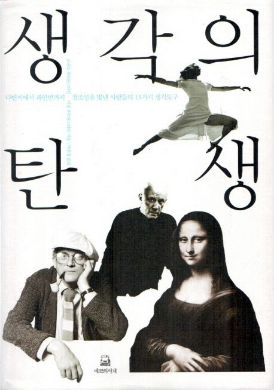

# 책-선정/251228 생각의 탄생

### [2025-12-21T12:29:57.841000+00:00] pappasco
로버트 루트번스타인, 미셸 루트번스타인 [공]

### [2025-12-28T13:02:27.110000+00:00] pappasco
# 12/28
생각의 탄생

친절한 책 - 크기 굵기 사진 예시 실습 

수능 비문학 느낌으로 읽었음

창조를 어렵게 받아들였는데 그리 어렵지 않겠네.

나는 시야가 좁은 사람이라는걸 깨달음. 두껍고 큰게 캔버스 같은 책이였다.

생각하는 도구 13가지 잘 알려줬다. 흥미로움.

평소 공부중인 애니메이터 분야에 이 방법들을 잘 이용해야겠다.

어떤 생각을 자주 사용, 즐기는가. 생각도구11 놀이 - 애너그램.

151 페이지 빠진 조각이 무엇인지를 보여주는 빈자리 역시 중요하다. 그것은 우리 자신이 모르는 것이 무엇인지 가늠하게 하는 단서가 되기 때문이다 

 - 내 빈자리는 무엇인가

195페이지 사실은 우리가 눈과 코 귀 입 피부를 통해 직접 지각할 수 있는 범위는 초라할 만큼 제한적이다. 

 - 표현이 참 아프게 공감된다 

198 페이지 오렌지가 포도같다 혹은 오렌지가 야구공 같다는 어린이의 말도 마찬가지다

 - 닮음과 유추가 알것 같으면서도 살짝 헷갈린다 이것도 유추의 한 방향 아닌가

209 페이지 내가 다섯 살이 될 때까지 우리 집의 작은 마당은 또 다른 우주였다 라고 말한다 

  - 참 행복한 어린 시절이었을 것 같다

211 페이지 만일 우리가 경기자에 뜻에 따라 움직이면 움직이는 졸이라면 얘기가 전혀 달라진다. 전략이나 게임의 결과는 꿈도 못 꾸며, 기껏해야 모든 게 너무 늦어지기 전에 가능한 한 삶을 즐기는 것 정도가 최선이 될 수 있을 것이다.

 - 예전에 내가 살아왔던 방식 많이 성장했구나 깨달음

229 페이지 배우란 모름지기 날카로운 관찰력과 발달된 근육 기억 능력을 가지고 있어야 한다 그래서 그 안에 저장된 자세와 몸짓을 항상 재생해낼 수 있어야 물론이고 사고와 몸을 조화롭게 연동시킬 수 있어야 한다

 - 몸으로 표현하는 방식이 살짝 추상적이어서 힘들다고 생각했는데 접근하는 방법을 여기서 나름 깨달았다

p247 감정이입의 본질은 다른 사람이 되어보는 것

  - 그렇게 아버지가 된다 추천. 감정이입 되는 영화.

p.254 호스 위스퍼러

  - 말을 굉장히 좋아한다 한번 보고 싶은 영화

342 페이지 애너그램 

 - 내가 좋아하는 단어놀이 중 하나 반갑다

394 페이지 그는 특정한 색에서 연상되는 음의 종류에 대해 추가적으로 언급하고 있다 남색은 플룻 파란색은 첼로 검은색은 베이스 하는 식으로 말이다

  - 나도 노래 듣고 그림 그려볼까

418 페이지 지식을 나무에 비유한다면 교육은 그 줄기 부분에 중점을 두어야 한다 

 - 요즘 제 생각하는 것 중 하나다 내 인생도 나무에 빗대어 생각했을 때 그 줄기 부분에 중점을 두어야 한다. 요즘 곁가지를 너무 많이 펼친 것 같아 정리가 필요하다고 생각함

427 페이지 대가는 어디서나 대가입니다 시인이 되고 싶다면 정비나 요리의 대가라고 생각하는 사람들을 찾아가 봐야 합니다. 그런 사람들 밑에서 공부하는 게 대가가 아닌 시인 밑에서 공부하는 것보다 시인이 되는데 훨씬 유리할 테니까요.

 - 편협하게 내가 알고 있는 분야 쪽으로만 생각하지 말고 폭넓게 보려고 노력할 생각을 가지자

### [2025-12-28T13:02:49.444000+00:00] pappasco
** 정리 **
1. 문준위 감독 발표

전반적 인상
《생각의 탄생》은 크기와 분량에 비해 매우 친절한 책이라고 느꼈음.
설명이 구체적이고 예시와 사진, 실습 안내까지 곁들여져 있어 이해를 돕기 위해 책이 길어진 것 같다고 해석함.
읽는 과정에서 수능 비문학 문제를 푸는 듯한 재미도 느껴졌으며, “갖고 놀기 좋은 책”이라는 인상이 강했음.

읽은 관점
창조에 대한 막연함을 느끼던 애니메이터로서,
‘창조는 특별한 재능이 아니라 접근 방식의 문제’라는 점에서 이 책이 좋은 출발점이 되어주었다고 평가.
특히 생각의 도구 13가지를 보며, 자신이 그동안 한두 가지 방식에만 의존해왔다는 점을 자각함.

인상 깊은 내용
생각의 도구 13가지를 모두 깊게 파기보다는,
“이런 방식도 있구나” 하고 전체를 훑는 경험 자체가 흥미로웠음.
**생각 도구 11번 ‘놀이’**가 가장 인상 깊었으며,
특히 애너그램(단어·알파벳 놀이)을 사고 확장의 즐거운 도구로 소개한 부분에 큰 공감을 느낌.

인상 깊은 문장
427p
“시인이 되고 싶다면 시인에게만 배우지 말고,
정비나 요리의 대가에게서 배워야 한다.”
→ 하나의 분야에 국한되지 않고,
다양한 ‘대가’에게서 사고방식을 배우라는 메시지로 해석함.
그동안 애니메이터가 되기 위해 애니메이터에게만 배워야 한다고 생각해왔던 자신의 시야가 다소 편협했음을 돌아보게 됨.

느낀 점 및 개인적 변화
이제는 전공과 직업의 경계를 넘어서
다양한 영역의 사람들과 경험에서 사고의 재료를 얻어야겠다고 다짐함.
창조는 한 길을 깊게 파는 동시에,
여러 길을 넓게 바라보는 데서 시작된다는 인식을 갖게 됨.
https://band.us/band/98814061/post/28

### [2025-12-28T13:03:24.126000+00:00] pappasco
251228 생각의 탄생

### [2026-01-04T13:07:38.686000+00:00] pappasco
# 1/4

—근황

비전보드 

신년 계획 

과제 감정표현 구현 후 맞추기

새로운 에세이 

플레이리스트 글쓰기 모임

퓨처 리더스 캠프 서류냈음

기회가 생기면 하고자 한다

— 감명 구절

315 페이지 시간과 공간 안에서 일을 한다는 것은 방정식이나 그래프 혹은 종이를 놓고 일하는 것과 전혀 다르다 그래서 차원의 문제는 중요한 것이 된다

  - 컴퓨터 그래픽에 대한 경계를 하고있자는 글이 생각하게되네

312페이지 과학적 모형의 역할은 큰 건물을 짓는 건축 현장에서의 비계와 크레인과 비교할 수 있다… 이론은 항상 자신이 의지했던 모형으로부터 스스로를 분리시키려 한다고 주장한다.

  - 내가 지금 하고 있는 과제의 컨트롤러와 개념이 맞닿아 있어서 흥미로웠다.

418 페이지 지식을 나무에 비유한다면 교육은 그 줄기 부분에 중점을 두어야 한다 

  - 요즘 제 생각하는 것 중 하나다 내 인생도 나무에 빗대어 생각했을 때 그 줄기 부분에 중점을 두어야 한다. 요즘 곁가지를 너무 많이 펼친 것 같아 정리가 필요하다고 생각함

3️⃣ 문준위 감독
연말에 만난 인물(강한 실행력)에서 영감
『생각의 탄생』 10번째 원리 ‘모형 만들기’를
→ 3D 툴 Maya 작업에 적용
파인먼의 “비계와 크레인” 비유 공유
→ 도구는 완성되면 사라져도 된다
학문이 실제 직업·작업과 연결될 수 있음을 체감

### [2026-01-04T13:07:46.094000+00:00] pappasco
https://band.us/band/98814061/post/29