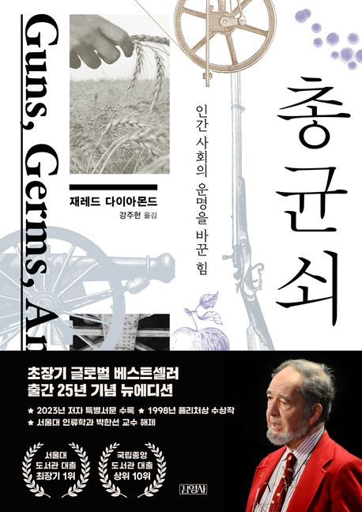

# 책-선정/260104 총, 균, 쇠: 인간 사회의 운명을 바꾼 힘

### [2025-12-21T12:33:19.475000+00:00] pappasco
재레드 다이아몬드

### [2026-01-04T13:08:56.444000+00:00] pappasco
260104 총, 균, 쇠: 인간 사회의 운명을 바꾼 힘

### [2026-02-06T14:26:30.329000+00:00] pappasco
# 1/4

—근황

비전보드 

신년 계획 

과제 감정표현 구현 후 맞추기

새로운 에세이 

플레이리스트 글쓰기 모임

퓨처 리더스 캠프 서류냈음

기회가 생기면 하고자 한다

— 감명 구절

315 페이지 시간과 공간 안에서 일을 한다는 것은 방정식이나 그래프 혹은 종이를 놓고 일하는 것과 전혀 다르다 그래서 차원의 문제는 중요한 것이 된다

  - 컴퓨터 그래픽에 대한 경계를 하고있자는 글이 생각하게되네

312페이지 과학적 모형의 역할은 큰 건물을 짓는 건축 현장에서의 비계와 크레인과 비교할 수 있다… 이론은 항상 자신이 의지했던 모형으로부터 스스로를 분리시키려 한다고 주장한다.

  - 내가 지금 하고 있는 과제의 컨트롤러와 개념이 맞닿아 있어서 흥미로웠다.

418 페이지 지식을 나무에 비유한다면 교육은 그 줄기 부분에 중점을 두어야 한다 

  - 요즘 제 생각하는 것 중 하나다 내 인생도 나무에 빗대어 생각했을 때 그 줄기 부분에 중점을 두어야 한다. 요즘 곁가지를 너무 많이 펼친 것 같아 정리가 필요하다고 생각함

### [2026-02-06T14:26:54.449000+00:00] pappasco
# 1/18
(오프라인 모임)

### [2026-02-06T14:26:57.404000+00:00] pappasco
# 1/24

땅이 크기가 중요하지 않다 

내 것을 차별되게 잘 가지고 있냐 

남에게 침략당하지 않는 내 것을 가지자

### [2026-02-06T14:28:45.629000+00:00] pappasco
# 밴드 글 정리

https://band.us/band/98814061/post/29
3️⃣ 문준위 감독
연말에 만난 인물(강한 실행력)에서 영감
『생각의 탄생』 10번째 원리 ‘모형 만들기’를
→ 3D 툴 Maya 작업에 적용
파인먼의 “비계와 크레인” 비유 공유
→ 도구는 완성되면 사라져도 된다
학문이 실제 직업·작업과 연결될 수 있음을 체감

https://band.us/band/98814061/post/30
4️⃣문준위 감독 질문지 답변 요약
『총, 균, 쇠』를 통해 인류 문명의 발전이 개인이나 민족의 능력이 아니라 환경과 필연적 조건에 의해 결정되었다는 저자의 관점을 핵심으로 받아들임. 유라시아 대륙이 먼저 발전한 이유는 농업 사회로 전환할 수 있는 조건이 이미 갖추어져 있었기 때문이며, 식량 생산의 시작은 사회의 안정과 인구 증가를 가져왔음.
특히 유라시아에 존재했던 다양한 곡물이 문명 형성의 토대가 되었다는 설명이 가장 설득력 있게 느껴졌음. 개인의 선택과 문화 역시 역사 발전에 중요한 영향을 미치며, 인간의 선택이 종의 변화와 유지에 실질적 역할을 해왔다는 점에 공감.
오늘날 국가 간 격차도 여전히 ‘총, 균, 쇠’의 논리로 설명 가능하며, 한국 사회 역시 군사적 환경, 감염병 경험, 산업 경쟁력이라는 구조 속에서 발전해 왔다고 보았음. 이 책은 성공과 실패에 대한 인식을 크게 바꾸기보다는, 기존에 가지고 있던 생각을 더 구조적으로 이해하게 만들었으며, 미래 사회 발전의 핵심은 인간이 선택하는 삶의 방식이 얼마나 넓게 확장될 수 있는가에 달려 있다고 정리.

https://band.us/band/98814061/post/31
『총, 균, 쇠』 3부를 함께 읽고 나누었습니다. (오프라인)
문명의 격차가 개인이나 인종이 아닌
환경과 구조의 축적이라는 관점을 중심으로
깊이 있는 질문과 생각 나눔이 이어진 시간이었습니다.

https://band.us/band/98814061/post/32
문준위 감독님 <총균쇠> 4부 발표 요약

✅ 완독 소감
방대한 분량이었지만, 한 달간의 ‘총균쇠 여행’을 완주했다는 것에 큰 만족감을 느낌. 혼자라면 힘들었을 과정을 모임을 통해 함께 할 수 있어 좋았음.
✅ 핵심 통찰: "땅의 크기보다 중요한 것은 차별화된 내 것"
유럽 vs 중국: 과학 기술이 앞섰던 중국이 유럽에 역전당한 사례를 보며, 국가의 크기보다 각자의 색깔을 가진 독립적 경쟁력(차별성)의 중요성을 깨달음.
결론: 남에게 침략당하지 않는 '나만의 독창적인 자산'을 가지는 것이 핵심임을 느낌.
✅ 4부의 묘미
앞선 1~3부의 논리들이 실제 6개 지역(오스트레일리아, 일본 등)에 어떻게 적용되는지 분석하는 과정이 흥미로움.
특히 한국인으로서 한국과 일본의 발전 과정을 작가의 시각으로 풀어낸 부분이 매우 몰입도 높았음.
"만족스러운 한 달간의 여행이었습니다. 발표 마칩니다. 감사합니다!"