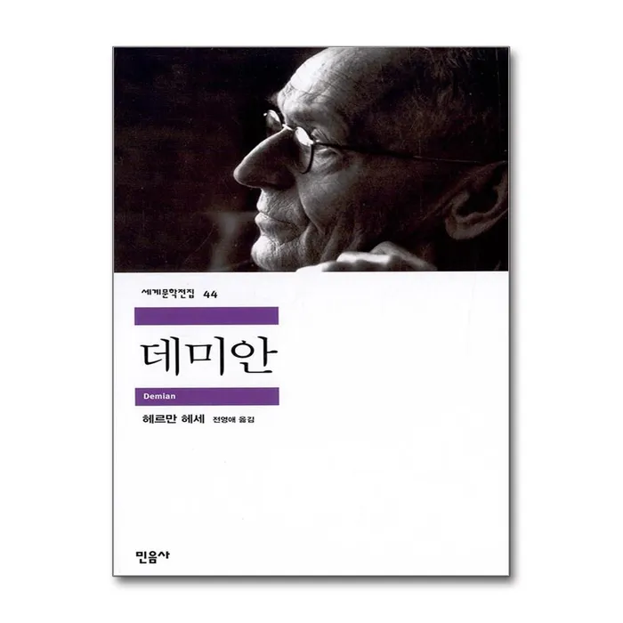
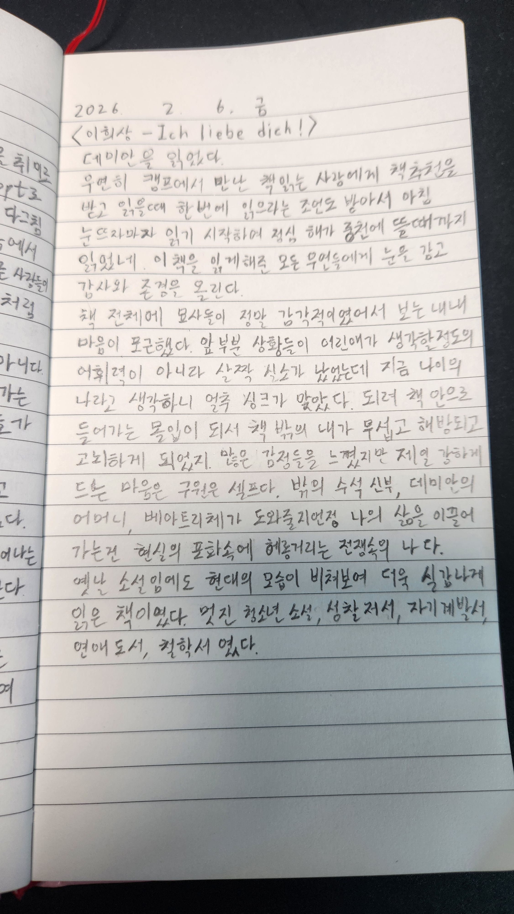

# 책-선정/260208데미안

### [2026-02-06T14:20:46.130000+00:00] pappasco
헤르만 헤세

### [2026-02-09T01:59:43.262000+00:00] pappasco
# 2/8
나를 찾고 깨우는것은 온전한 나이다. 구원은 셀프다.

다 읽는데 6시간 걸린듯. 즐거운 의식의 흐름.

### [2026-02-10T05:05:33.354000+00:00] pappasco
116  우리 속에는 모든 것을 알고, 모든 것을 하고자 하고, 모든 것을 우리 자신보다 더 잘 해내는 어떤 사람이 있다는 것 말이야.
-> 나의 능력은 내 생각 이상이다

134  그럴 때는 그냥 문을 두드리시오. 노크는 힘차게 해야 해요.
-> 노크를 해야 도와줄 수 있다

138  이리 와 보시오.” 그가 한참 뒤에 말했다. “우리 이제 철학 좀 해 봅시다. 철학을 한다는 건 ‘아가리 닥치고 배 깔고 엎드려 생각하기’라고 하오.”
->철학을 어떻게 할까 살짝 고민했던 적이 있었는데 이게 맞는 것 같아

143  그러나 그들은 세계가 자기 안에 있다는 사실은 몰라. 한 그루 나무거나 돌인 거지, 기껏해야 동물이고. 그 사실을 모르는 한 말이야. 그러나 이런 인식의 첫 불꽃이 희미하게 밝혀질 때, 그때 그는 인간이 되지.
-> 세계를 안다 나를 안다 내 안에 있다

158  그러고는 정말로 네 본질로부터 나오는 것, 그걸 하면 돼. 다른 길은 존재하지 않아. 네가 너 자신을 찾아낼 수 없으면 다른 영(靈)들도 찾아낼 수 없을 거야.
-> 내가 가진 것 내 본질 내가 내 자신을 찾아라

171  자기 자신을 찾고, 자신 속에서 확고해지는 것, 자신의 길을 앞으로 더듬어 나가는 것.
-> 나 자신을 찾아 나가는 길 세계에다 무엇을 준다는 것이 아니다 그저 나만 알 수 있는 그 길.