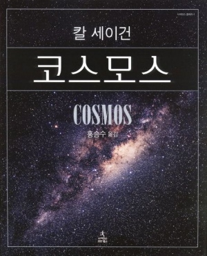
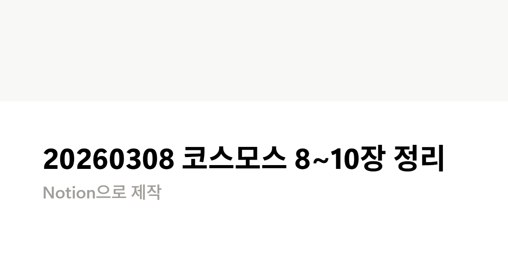
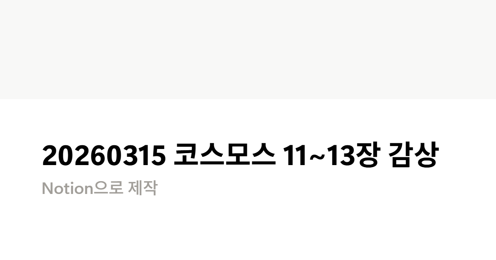

# 책-선정/260222코스모스

### [2026-02-06T14:25:46.717000+00:00] pappasco
칼 세이건

### [2026-02-10T15:04:08.896000+00:00] pappasco
260222코스모스

### [2026-02-22T12:09:28.348000+00:00] pappasco
# 2/22

코스모스 1~4장

책 선정을 굉장히 잘했다 총균괴로 땅에 대한 내용을 쭉 봤다면 코스모스 책에서는 하늘을 자세히 관찰하는 느낌으로 보게됨. 땅과 하늘을 어우르는 일정의 책읽가 되었다. 기분좋은 시작이 됨.

112 페이지 하늘의 해 달 별 말고 또 다른 종류의 천체가 있는데 사람들은 이것들을 떠돌아다니는 별이라는 뜻에서 통틀어 행성이라고 불렀다

— 떠돌아다니는 별이라는 뜻이었구나 이제 알았네

3장의 케플러 부분부터 감정이입이 되면서 열심히 읽었음 과거 삶에 공감이 많이 됨

주변에 좋지 않은 상황(관측자료를 가지려고만 했던 튀코 브라헤의 비협조적)에서도 두려움을 이겨내고 자기 연구를 해냈다는 것이 정말 멋있음.

195 페이지 

그러나 과학은 자기검증을 생명으로 한다 …

과학은 자유로운 탐구정신에서 자생적으로 성장했으며 자유로운 탐구가 곧 과학의 목적이다 …

우리는 어느 누가 근본적이고 혁신적인 사고를 할지 미리 알지 못하기 때문에 누구나 열린 마음으로 자기 검증을 철저히 해야 한다

— 이론을 자유롭게 제시할 수 있다 하지만 거기에 대한 자기검증이 뒤따라온다는 것을 명심하자

### [2026-03-08T11:39:59.542000+00:00] pappasco
# 3/1

[20260301 코스모스 5~7장 정리](https://www.notion.so/20260301-5-7-316f7a021a57805581a7fc3428a49fd2?pvs=21)

### [2026-03-08T11:40:31.511000+00:00] pappasco
# 3/8

[20260308 코스모스 8~10장 정리](https://www.notion.so/20260308-8-10-31df7a021a57805982d8e9c3f4720d9c?pvs=21)

### [2026-03-15T11:57:57.538000+00:00] pappasco
# 3/15

[20260315 코스모스 11~13장 감상](https://www.notion.so/20260315-11-13-324f7a021a57800c8c16c804754c54fa?pvs=21)
