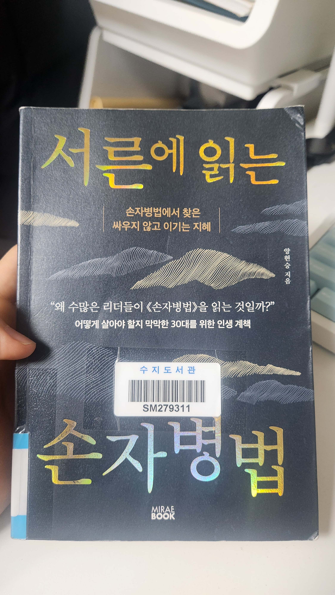

# 책-선정/260419 손자병법

### [2026-04-12T12:06:23.004000+00:00] pappasco
개인별로 읽고싶은 손자병법 책 읽기.

내가 고른책 - 서른에 읽은 손자병법 : 양현승 지음

### [2026-04-19T12:42:34.777000+00:00] pappasco
# 4/19

내가 선택한 책 : 서른에 읽는 손자병법 / 양현승 지음 / 미래북
https://product.kyobobook.co.kr/detail/S000217919065

손자병법은 나와 상대방을 이해하는 방식의 실전서.

내가 유리한곳에서 활동하기.

p214 글귀 좋아함 - 한가지 뜻을 가지고 그 길을 걸으라! 잘못도 있으리라! 그러나 다시 일어나서 앞으로 가라! 

생각보다 원문은 길지 않구나. 찾아봐야겠다.

내가 삶을 마주하는 방식에 대해 점검해보고 나만의 시각으로 고전을 인용하는방법에 대해 생각해보게 됨.

읽는중에 밴드 팀 이름에 대한 여러 아이디어가 떠올라서 끝까지 읽는상황에 집중한다고 노력했던 책

민철 대표님 선택도서

 - 손자병법 이겨놓고 싸우는 인생의 지혜 /  소준섭 역 / 현대지성

의미가 있어야함. 

도천지장법이란 어떠한것인가.

— 도에 강점을 가지고 계심.

정正, 기奇에 대한 논의 / 기 → 기세로 해석. 종교인 분들. 대통령분들 예시.

### [2026-04-19T12:48:47.193000+00:00] pappasco
260419 손자병법