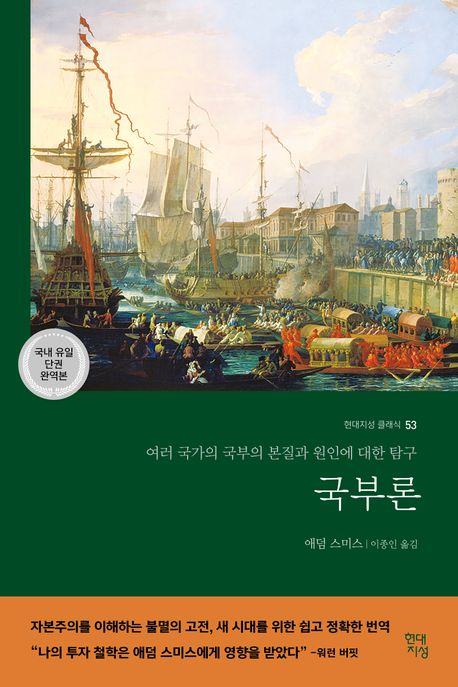

# 책-선정/260510 국부론

### [2026-04-30T10:46:51.256000+00:00] pappasco
애덤 스미스 저자 / 이종인 옮김 / 현대지성

### [2026-05-10T11:51:33.097000+00:00] pappasco
# 5/10

내용이 숫자가 많아 빡세다.

해설을 재밌게봤다.

사랑, 자유, 공동체를 지향하는 애덤스미스.

당연하다고 생각한것들의 기초가 이 책에서 나왔구나 생각하게됨.

도덕감정론 읽어보고싶다.

그 나라의 토지와 노동의 연간 생산량과 주민의 실질적 보호와 수입에 훨씬 더 큰 가치를 나온다 자본이 사용될 수 있는 모든 방법 중에서 가장 사회에 유익한 방법이다

보이지 않는 손에 인도되어 자기가 전혀 의도하지 않은 목적을 추구한다 개인이 공공이익에 매진하려는 의도를 가지지 않는다는 사실이 사회를 위해 나쁘기만 한 것은 아니다 개인은 자기 이익을 추구함으로써 사회 이익을 일부러 추구했을 때보다 더 효과적으로 사회를 위한 이익을 따르기 때문이다

건강한 신체는 나쁜 속셈 상태에서도 건강을 유지하며 살아나갈 수 있다

어떤 물건을 다른 데서 더 싸게 살 수 있다면 그 물건을 집에서 만들려고 하지 말라

인간이 자신 자기 자신을 사랑하는 행동을 충실히 해나갈 때 보이지 않는 손이 적용해 사회의 공동성이 더욱 강력하게 추진된다는 것이다

후회하지 말고 앞으로 걸어 나가라. 중얼거리거나 불평하지도 말라. 평온하고 만족하고 기뻐하며 걸어가라. 

신들에게 감사의 말을 전하라. 그들은 무한한 자비로 죽음이라는 안전하고 조용한 항구를 우리에게 열어, 언제든 인간의 세상이라는 폭풍우 속에서 우리를 피난처로 받아들일 준비를 하고 있다. 그러므로 그들에게 감사하라.

그의 효심은 대단해 이 세상에서 제일 좋은 것이 어머니, 친구 그리고 책이라고 할 정도였다.

### [2026-05-10T11:51:46.894000+00:00] pappasco
260510 국부론