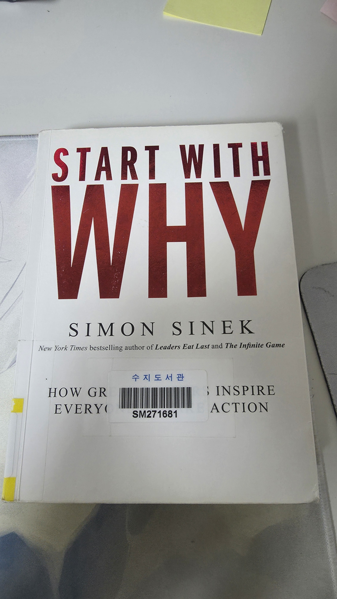

# 책-선정/260531 나는 왜 이 일을 하는가

### [2026-05-31T11:52:12.169000+00:00] pappasco
# 260531 나는 왜 이 일을 하는가

오~? 하는 반응을 보기위해서 일한다.

WHY서부터 출발하는 골든 서클. → 정체성, 신념의 점검.

열정은 감정에서 나온다. 충성심.

나는 조종당하고 있나  어떤점에 끌려가고 있나. - 관성적으로 하던 게임 그만두고. 다른 게임 새로시작.

신뢰를 다지는 리더. 리더는 WHY를 벙확히 꿰뚫고있다.

애플이라는 회사가 가지는 수많은 방향성에 많은 자기계발서가 인용되고있음. 내가 애플에서 어떤점이 이끌려 자기계발서를 하나 쓸수 있지 않을까?

317페이지. 대의를 그대로 이어나가려고 하는 CEO를 찾는 것이다. 

356페이지: 리더십이란 항상 사람을 이끄는 일이다.

358페이지.

리더에게는 두 가지가 필요하다: 아직 존재하지 않는 세상을 향한 비전과 이를 명확히 전할 소통 능력이다.

359페이지: 리더는 훌륭한 아이디어를 혼자 내는 사람이 아니라, 참여를 원하는 이들에게 지지를 보내는 사람이다.

최근 드라마 모두가 자신의 무가치함과 싸우고 있다 재밌게 보는중. 구교환의 삶의 방식에 단단함을 느낌.

나의 삶에도 특장점이 있구나. 어떤 특징과 고려사항이 있는지 정리해야지.

→ 왜 저렇게까지 살려고하는지, 증명하려고 하는건지 생각하게 됨.

### [2026-05-31T12:18:10.632000+00:00] pappasco
사실 기본적으로는 ‘그냥’이라고 생각함.

그냥을 넘어서는 어떠한 WHY는 없다.

인식의 해상도를 높여보면 나오는것이 맨위의 답변.