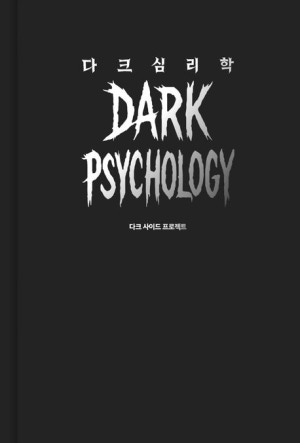

# 책-선정/260607 다크심리학

### [2026-06-07T11:38:28.820000+00:00] pappasco
# 6/7

나의 모습이 어둠의 3요소 마키아벨리즘. 목적주의. 필요할떄 연락하고.

현실에 맞춘 심리학의 내용이라 이해가 쉬움. 실제생활에서 누가 어떤 모습인지 

인간활동에서 예방접종 받는 시간으로 느낌

### [2026-06-07T11:38:44.755000+00:00] pappasco
260607 다크심리학

### [2026-07-19T12:21:08.148000+00:00] pappasco
# 6/14

242 페이지 흩어지지 않는 힘은 결단에서 비롯된다. 자 일단은 나의 일을 지속하는데 큰 중심점이 돼 간다

247 페이지. 당신은 이 무기를 쓸 수 있겠는거야? 두려워하고 더 좋다. 망설여도 괜찮다. 하지만 당신의 결단으로 흩어진 힘의 무기력하면서 벗어날 수 있고 누군가와의 전쟁에서도 압도가 무엇인지 보여줄 것이다.

두려워해도 좋고 망설여도 좋으니 나의 결단으로 전쟁을 앞두자.

256 페이지 숨는 것이 목표가 되어선 안 된다. 왜 숨고 왜 등장하느냐에 대한 답을 스스로 찾아야 한다.

숨는 이유는 등장을 위한 것이다.