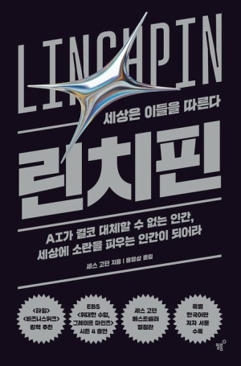

# 책-선정/260628 린치핀

### [2026-07-19T12:23:47.338000+00:00] pappasco
# 6/28

내 안의 예술성에 대해 고민해보게 만들어 준 책.

행동하는 나를 세상에 보여주자. 그림자가 생기는건 빛을 향해 나아갔기 때문이다. 

진심으로 나를 던진다.

남들과 다르다는 이유만으로 꼭 필요한 사람이 되는 것은 아니다. 하지만 꼭 필요한 사람이 되기 위해서는 남들과 달라야 한다.

그것이 유일한 방법이다. 남들과 다른 점이 없다면 우수한 사람들 중 하나에 지나지 않는다.

모든 것은 선택의 문제다.

두려움에 굴복하고 시스템에 항복하는 선택을 할 것인가? 아니면 자신의 길을 헤쳐나가면서 그 길에서 가치를 만들어낼 것인가?

문제는 길을 만들어내는 것이다. 우리는 그 방법을 알아야 한다.

벌떡 일어나서 튀어라. 인간이 되어라. 참여해라. 상호작용해라.

나만의 직관, 혁신, 통찰을 내보이면 남들을 화나게 만들까 걱정하지 마라. 쓸데없는 걱정일 뿐이다. 아마도 사람들은 그런 면을 보이는 당신의 모습에 더 즐거워할 것이다.

그 정도의 위험은 과감하게 무릅쓰라.

혼자 일하든 함께 일하든 누구나 이미 생산 수단을 가지고 있다. 누구나 마음만 먹으면 꼭 필요한 사람, 
린치핀이 될 수 있다.

시그널과 노이즈

자신에게 D를 주어라. 현 상태에 도전하는 결과를 만들어내라.
