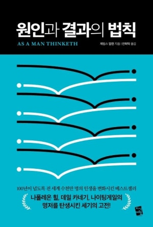

# 책-선정/260809 원인과 결과의 법칙

### [2026-09-06T11:59:20.662000+00:00] pappasco
*(텍스트 없음)*

### [2026-09-06T12:01:17.360000+00:00] pappasco
(미참여)

모임을 통해 <원인과 결과의 법칙>에서 "나를 결정하는 것은 나를 둘러싼 환경이 아니라, 오직 나 자신이어야 한다."는 인사이트를 얻게 된 귀한 시간이었던 것 같습니다.

사람, 환경따라 인생좌지우지
내 마음과 정신을 따라감 
-> 빅터프랭클 죽음의 수용소에서 내용과 같은 방향성
--> 과거의 정신이 이어져오는구나