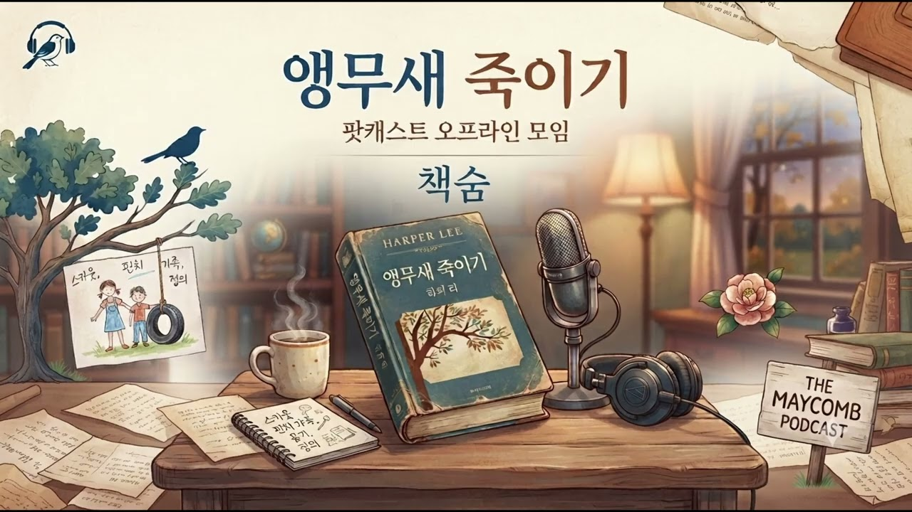
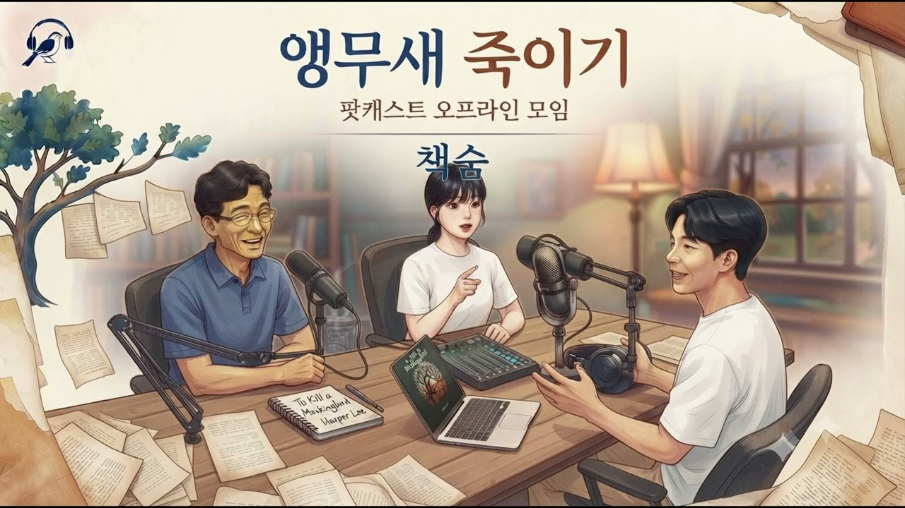

# 책-선정/260830 앵무새 죽이기 팟캐스트 녹음

### [2026-09-06T12:15:26.646000+00:00] pappasco
안녕하세요. 날씨가 시원해진만큼 꽤나 놀러가기 좋은 맑은 금요일 오후입니다.
8.30 일요일 경기도서관 팟캐스트 편집이 완료되어 업로드 하였습니다~~!
1부 발표진행을 준비 및 발표해주신 변인설 작가님, 2부 진행을 맡아주셔서 좋은 분위기를 이어주신 신민철 대표님께 다시 한번 감사인사를 드립니다.
좋은 하루 되시고 이번주 일요일 저녁에 뵙겠습니다!

[책숨 팟캐스트] 앵무새 죽이기 : 
1부 - 책의 배경과 작가 이야기
https://youtu.be/D2mSsdYWWfs?si=o_SEJs2MAYsXNEhF
2부 - 자유 대화, 발문 답변
https://youtu.be/OHChd6wob3U?si=Cz_-c-tOE55lEq_g

### [2026-09-06T12:18:19.981000+00:00] pappasco
📚 8/30(일) 『앵무새 죽이기』 오프라인 팟캐스트 모임 안내

안녕하세요 😊
다음 주 일요일, 함께 읽은 하퍼 리의 『앵무새 죽이기』를 가지고 오프라인 팟캐스트 모임을 진행합니다.

🗓 일시
8월 30일(일) 오후 3시 ~ 6시

📍 장소
경기도서관 스튜디오
※ 스튜디오 층수는 확인 중입니다.
👉 당일 경기도서관 1층에서 먼저 만나 스튜디오로 함께 이동하겠습니다.

🎙️ 다음주 팟캐스트 진행 순서

1. 책의 배경과 작가 이야기

* 하퍼 리와 『앵무새 죽이기』가 탄생한 배경
* 하퍼 리에 대해서

2. 함께 이야기 나눌 5가지 질문

① ‘앵무새를 죽인다’는 것의 진짜 의미는 무엇일까?
Boo Radley와 Tom Robinson은 왜 ‘앵무새’에 비유될 수 있을까요?
사회가 무고한 존재를 어떻게 상처 입히고 파괴하는지, 그리고 오늘날 우리 주변의 ‘앵무새’는 누구인지 이야기해봅니다.

② 법과 정의는 항상 일치할까?
Tom Robinson의 재판은 절차적으로 진행되었지만 결과는 부당했습니다.
법이 존재한다고 해서 정의가 실현되는 것은 아닐까요?
만약 내가 그 재판의 배심원이었다면 어떤 판결을 내렸을지도 생각해봅니다.

③ ‘다른 사람의 입장에서 걸어보라’는 말은 정말 가능할까?
Atticus의 가르침을 통해 Scout가 Boo Radley를 이해해가는 과정,
Jem이 Mrs. Dubose를 바라보는 시선의 변화를 살펴봅니다.
그리고 현실에서도 우리는 정말 타인의 입장이 되어볼 수 있는지, 그 한계는 무엇인지 이야기해봅니다.

④ 1930년대 미국 사회를 바라보며
100년 전의 모습이 지금과 비교했을 때 놀라웠던 모습은 무엇이었나요?
우리나라의 과거와 비교했을 때 인상 깊었던 점도 함께 나눠봅니다.

⑤ 등장인물 중 한 명에게 따뜻한 말을 건넬 수 있다면?
누구에게 어떤 말을 해주고 싶은가요?

🌿 Extra Question
왜 이 책은 퓰리처상을 받았을까요?
단순히 좋은 이야기를 넘어, 이 작품이 당시 사회와 인간의 모습을 어떻게 담아냈는지 생각해봅니다.

3. 마지막 한마디
📖 『앵무새 죽이기』를 읽고 난 후
“이 책은 나에게 ________였다.”
각자 한마디로 느낌을 나누며 마무리하겠습니다.

이번에는 책의 내용을 이야기하는 것을 넘어
‘정의란 무엇인가’, ‘타인을 이해한다는 것은 무엇인가’, ‘우리 사회의 앵무새는 누구인가’까지 함께 생각해보는 시간이 될 것 같아요.

일요일 오후, 책 한 권 들고 편하게 만나요.
첫 팟캐스트 오프라인 모임이 기대됩니다 😊📚🎙️

이작가님은 비대면으로 참여하시고, 
이강철님과 하성희님께서도 시간되신다면 가볍게 참여하시면 너무 좋을 것 같습니다😊

--------------------

내 답변
1
앵무새.
이방인. 여기저기 끼지못해 중간에서 따라하는정도의 사람들. 열심히 사회에 섞이고싶지만 그러지 못한 자들.
그런사람들을 벽세우고 탄압하는 내용.
2
매정하게도 일치하지않는다.
외부사회를 인정하지않음.
3
상대방의 입장이란 쉽지않다.
내가 살아가는 과정마저 벅차기에.
그럼에도 알아가야하는것.
4
말도 안되는 편견들이 가득한건 여전하구나.
일제시대의 탄압에 맞선 우리들의 모습이 흑인 
톰의 답변
변호사님도 저처럼 깜둥이였다면 겁이 났을 겁니다
우리나라의 핍박받던 사람들.
5
듀보스 할머니.
할머니의 신념이 멋져요. 
누구한테도 기대지않는다.
끝까지 지키고자 했던 용기에 무한한 존경을 올립니다.

마지막 한마디
이책은 나에게 현실을 깨우쳐준 각성제었다