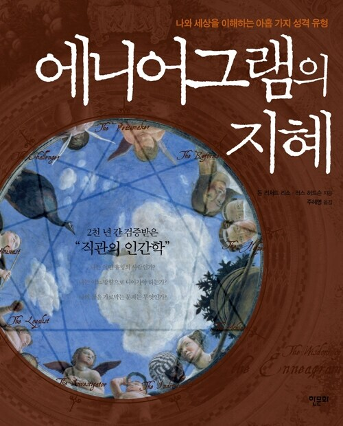

# 책-선정/260906 애니어그램의 지혜

### [2026-09-06T12:18:56.627000+00:00] pappasco
나의 유형 9번 평화주의자.
사람들을 화합하게 하고 갈등을 치유할 수도 있고, 수동적이고 고집스러워질 수도 있다.

ENFP 민철 대표님 간략테스트를 통한 유형판별결과 : BY - 4번 개인주의자.
창조성과 직관을 가질 수도 있고, 우울증과 자의식에 빠질 수도 있다.

최근들어 힘든 문제와 상황에 대해 본능적으로 회피하려는 마음이 많이 생김. 책을 더 읽어서 슬기롭게 해결하는 방법을 찾고자 한다.
