# rain명상정리

### [2025-07-07T08:27:56.809000+00:00] pappasco
명상 쇼츠로 만들기로 결심함. 
몇번 사진인증만 올렸는데 민망해서 내가 좋아하는 노래 기록할겸, 나눌겸, 좋아하는 구간 한번 더 듣는 느낌.
좋아했던 뮤지컬, 디즈니 영화에 나오는 음악 사용.

060825일
https://youtube.com/shorts/rq9KpKH7Mcw
오늘 루틴 올립니다. 배경음악은 잊혀지지 못할 언어 다즈비 cover 버전입니다.

060725토
https://youtu.be/DpkHPKOJS3o?feature=shared
오늘 루틴 올립니다. 배경음악은 겨울왕국 ost For the First Time in Forever입니다.

060625금
https://youtu.be/lfToQzO3rJg?feature=shared
오늘 루틴 올립니다. 배경음악은 제가 좋아하는 라라랜드 ost Another Day Of Sun 입니다.

060525목
https://youtube.com/shorts/8FNwEWq0Bzc?feature=shared
오늘부터 챌린지 쇼츠로 짧게 만들어서 올려보려구요. 오늘 배경음악은 this is me 입니다. 좋은 하루 되세요~

060425수
https://youtube.com/shorts/K14OCaqab20?feature=shared
(사진만 올렸었음. 밑에 영상이랑 이 영상은 핸드폰에 있는 삼성 갤럭시 ‘오버 더 호라이즌' 사용)

060325화 
060225월
https://youtube.com/shorts/2RBhMoH2iVk?feature=shared
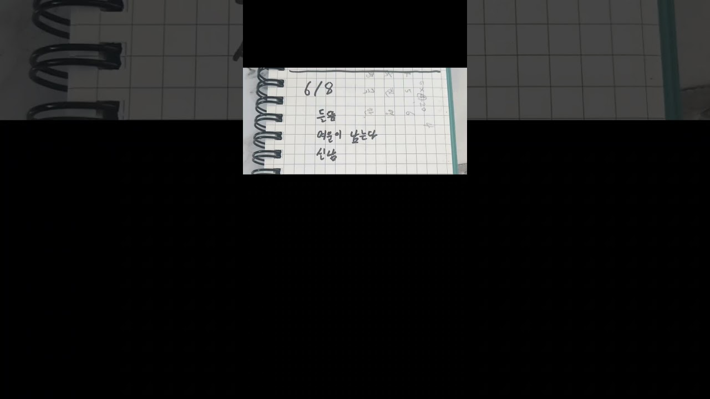

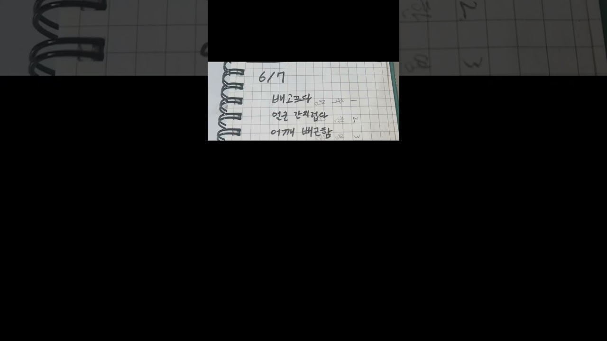

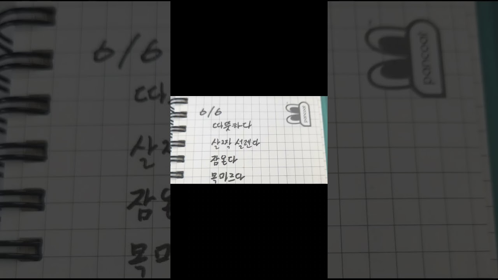

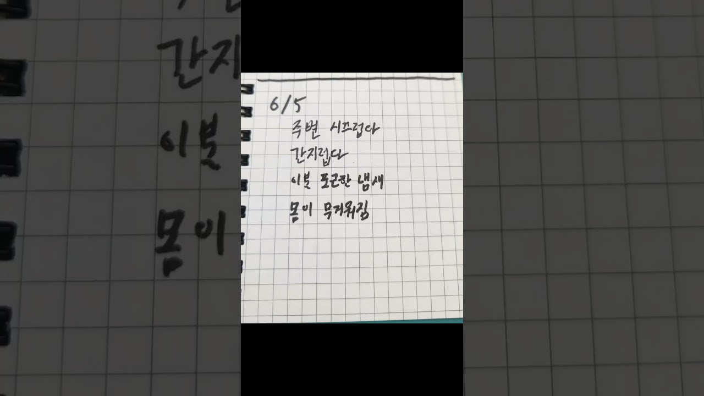

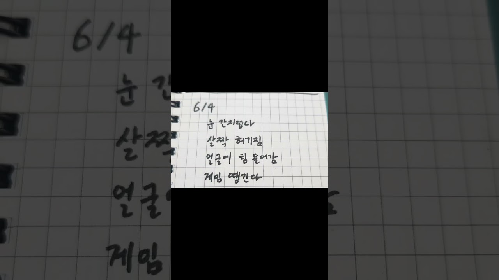

### [2025-07-07T08:28:27.556000+00:00] pappasco
힘을 주는 음악을 선정. 
토욜엔 비와서 비올떄 자주 생각나는 음악.
일본 노래를 좋아하는데 일요일마다 좋아하는 유명 일본음악을 사용할 예정.

061525일
https://youtube.com/shorts/JZc8RxZjcQA?feature=shared
오늘 루틴 올립니다. 배경음악은 오피셜 히게단디즘 'Pretender' 입니다.

061425토
https://youtube.com/shorts/b1y5FFPhByc?feature=shared
오늘 루틴 올립니다. 배경음악은 '빗속에서' 존박 cover버전 입니다.

061325금
https://youtube.com/shorts/9JqbW7jp2y4?feature=shared
오늘 루틴 올립니다. 배경음악은 에일리 '깨어나' 입니다.

061225목
https://youtube.com/shorts/fpt7oRh27mA?feature=shared
오늘 루틴 올립니다. 배경음악은 위키드 ost 'Defying Gravity' 입니다.

061125수
https://youtube.com/shorts/wAql0zgaDyQ?feature=shared
오늘 루틴 올립니다. 배경음악은 박혜경 '주문을 걸어' 입니다.

061025화
https://youtube.com/shorts/c1JrCxqIqWs?feature=shared
오늘 루틴 올립니다. 배경음악은 터치드 '불시'입니다.

060925월
https://youtube.com/shorts/EQ_uR11VoE0?feature=shared
오늘 루틴 올립니다. 배경음악은 가호의 노래 '시작'입니다.
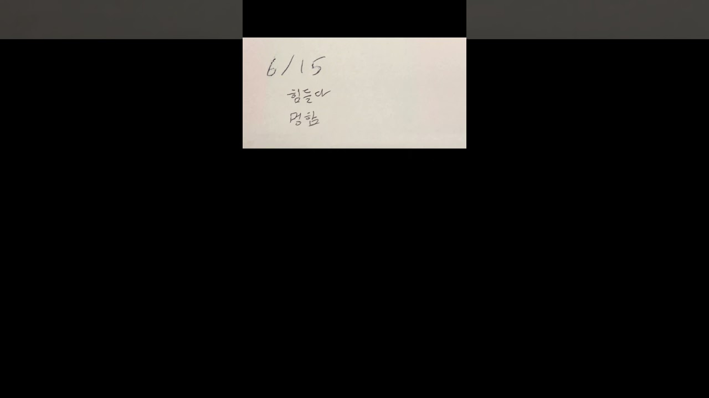

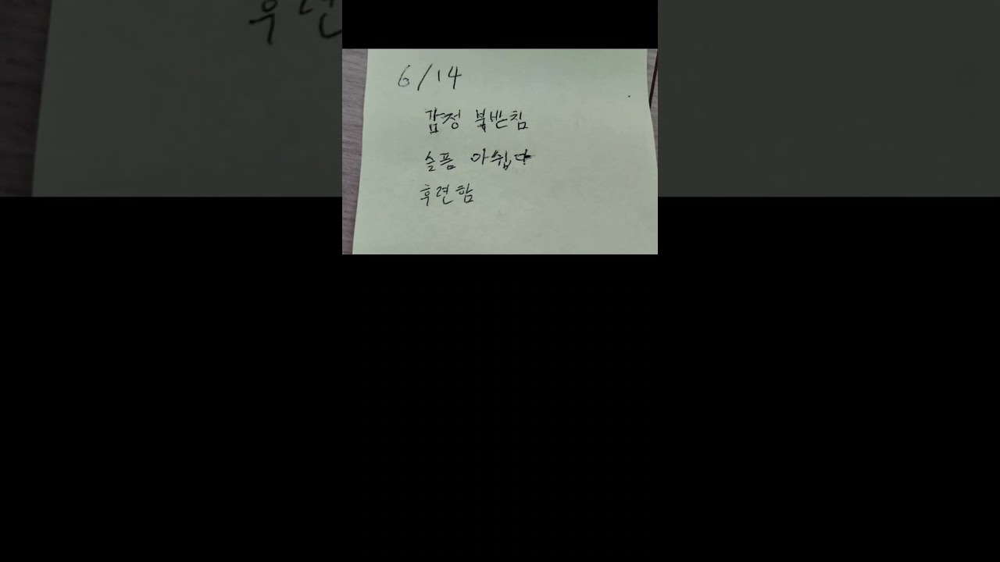

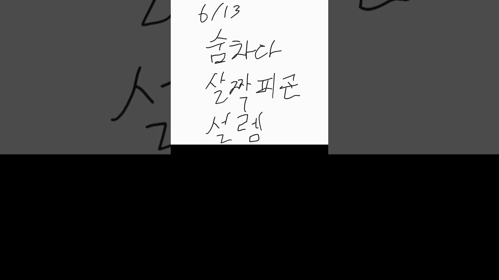

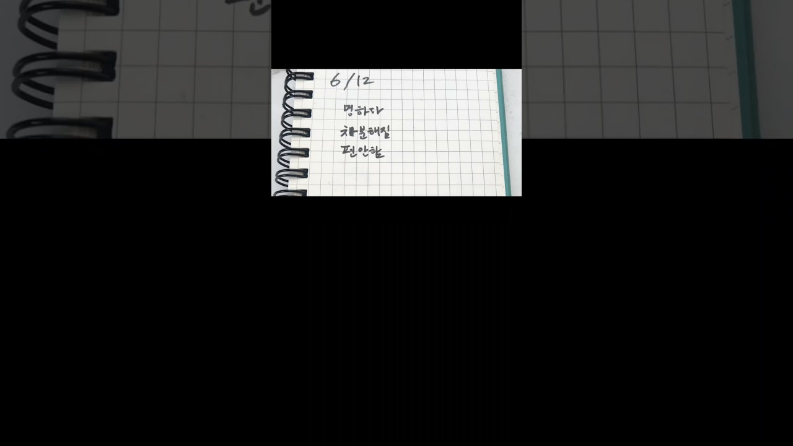

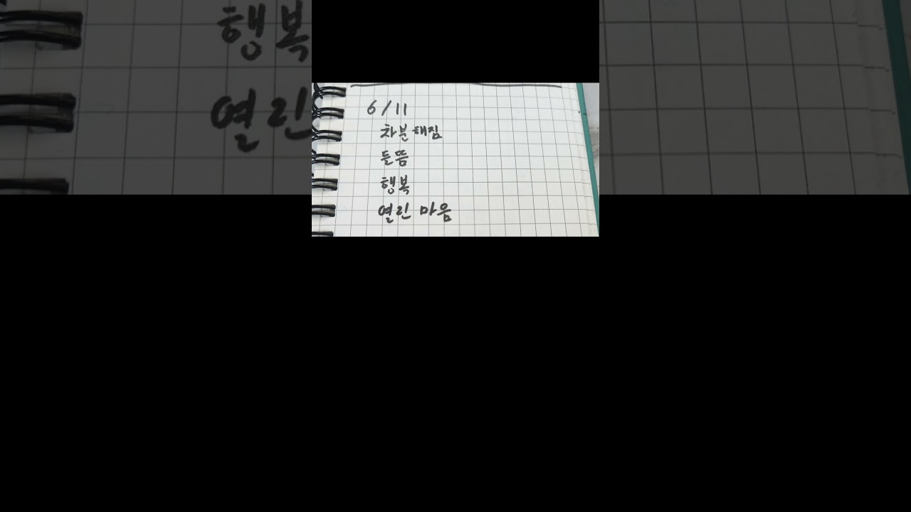

### [2025-07-07T08:28:50.213000+00:00] pappasco
'이 별에 필요한' 넷플릭스 영화를 감명깊게 봄. 요즘 한국 애니메이션도 촌스럽지않고 잘나오는구나.
콜드플레이 콘서트 스탠딩으로 갔다왔는데 그리웠음.
종소리 관련 ai노래를 들으니 생각남.
스윙걸즈 영화를 미루고 미루다 다봤음. 청춘이 생각나는 영화.

062225일
오늘 루틴 올립니다. 배경음악은 스윙걸즈 ost 'Sing Sing Sing with a Swing' 입니다.
https://youtube.com/shorts/7vkYZvRgcNM?feature=shared

062125토
오늘 루틴 올립니다. 배경음악은 윤미래 '삶의 향기' 입니다.
https://youtube.com/shorts/aHQmVGwQj2Y?feature=shared

062025금
오늘 루틴 올립니다. 배경음악은 러블리즈 '종소리' 입니다.
https://youtube.com/shorts/V-Vj-EmnYns?feature=shared

061925목
https://youtube.com/shorts/A2zsGgnTBYY?feature=shared
오늘 루틴 올립니다. 배경음악은 윤하 '오르트구름' 입니다.

061825수
https://youtube.com/shorts/-zQxdUfZVzg?feature=shared
오늘 루틴 올립니다. 배경음악은 콜드플레이 'Viva La Vida' 입니다.

071725화
https://youtube.com/shorts/crsbafD4Am8?feature=shared
오늘 루틴 올립니다. 배경음악은 이 별에 필요한 ost 'Life goes on' 입니다.

061625월
https://youtube.com/shorts/6x4P7S4rcrA?feature=shared
오늘 루틴 올립니다. 배경음악은 루시 'Hero' 입니다.
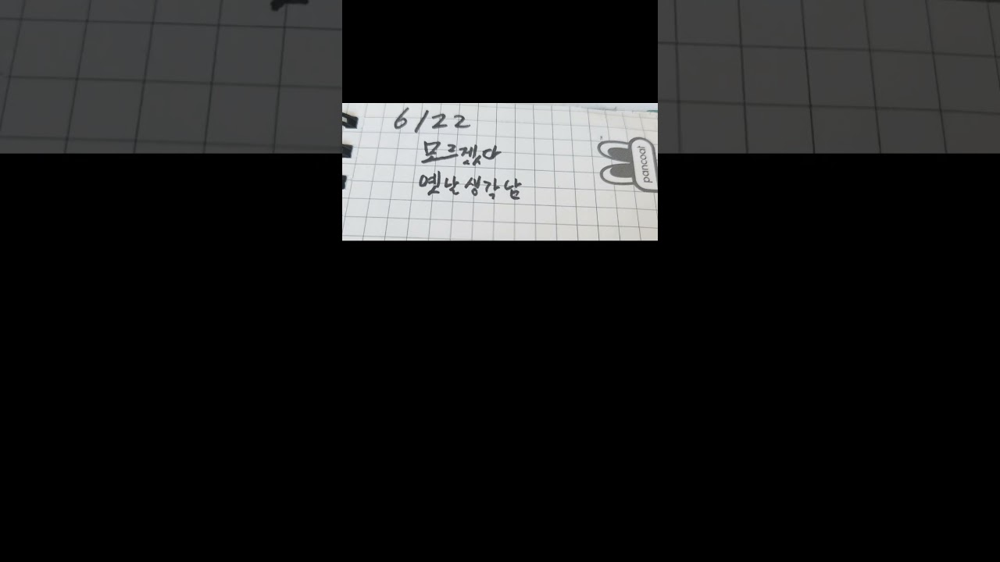

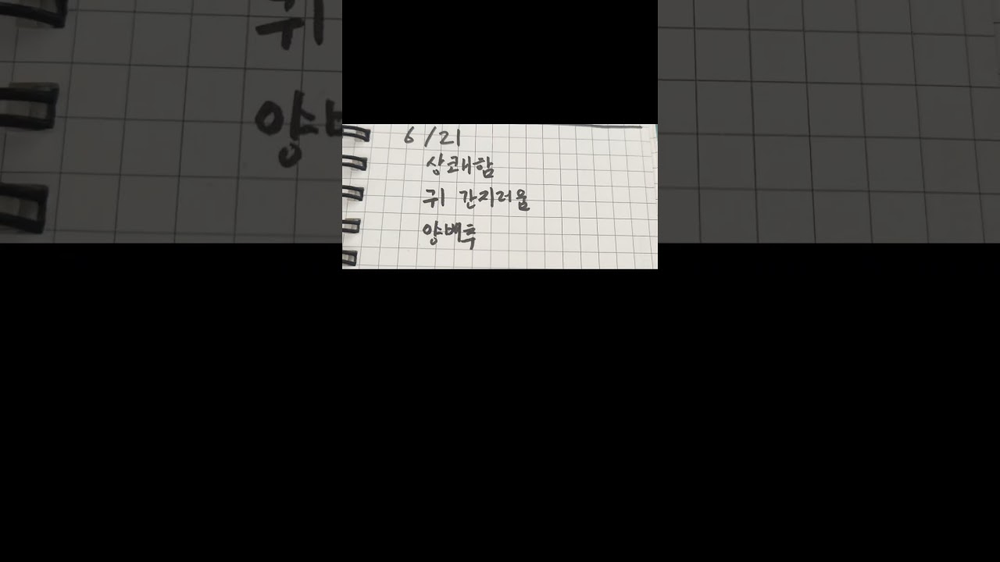

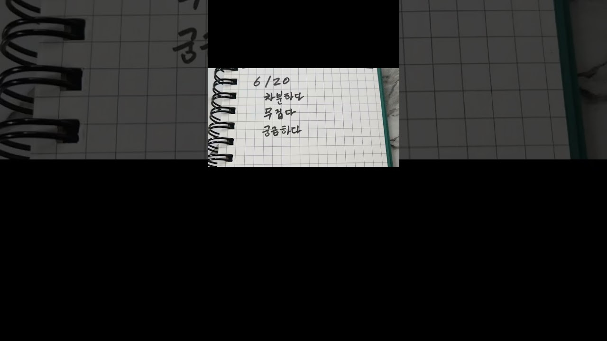

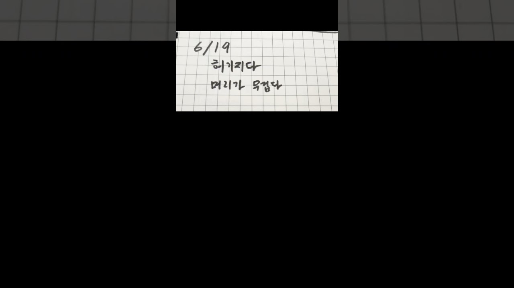

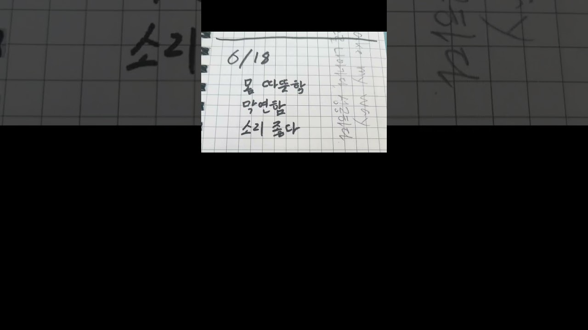

### [2025-07-07T08:29:09.739000+00:00] pappasco
엔플라잉 노래에서 청춘이 느껴지는 내용이 많음.
집에 밤편지 멜로디가 나오는 오르골이 있음.
케이팝데몬헌터스 엄청재밌어서 영어원본, 한글 더빙버전 두번봄.
back number 노래의 비하인드가 참 좋다.

062925일
오늘 루틴 올립니다. 배경음악은 back number '수평선' 입니다.
https://youtube.com/shorts/nLV0aMecp64?feature=shared

062825토
오늘 루틴 올립니다. 배경음악은 케이팝데몬헌터스 ost 'How It's Done' 입니다.
https://youtube.com/shorts/9RxZRUsazOU?feature=shared

062725금
오늘 루틴 올립니다. 배경음악은 콜드플레이 'Fix You' 입니다.
https://youtube.com/shorts/J3A8NH6RiBw?feature=shared

062625목
오늘 루틴 올립니다. 배경음악은 Fall Out Boy 'The Last Of The Real Ones' 입니다.
https://youtube.com/shorts/QIaEsmpH6fc?feature=shared

062525수
오늘 루틴 올립니다. 배경음악은 아이유 '밤편지' 입니다.
https://youtube.com/shorts/mJ_7PEvSNYM?feature=shared

062425화
오늘 루틴 올립니다. 배경음악은 엔플라잉 '만년설' 입니다.
https://youtube.com/shorts/BT6JttVEiEs?feature=shared

062325월
오늘 루틴 올립니다. 배경음악은 디어에반핸슨 ost 'You Will Be Found' 입니다.
https://youtube.com/shorts/mcETgQszh-0?feature=shared
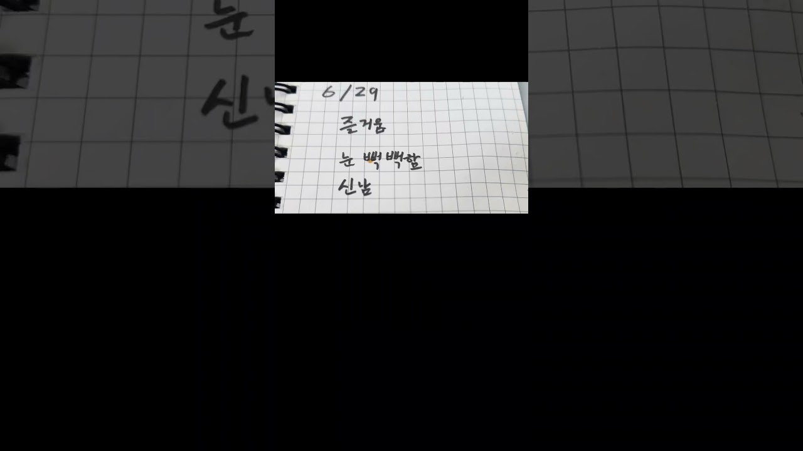

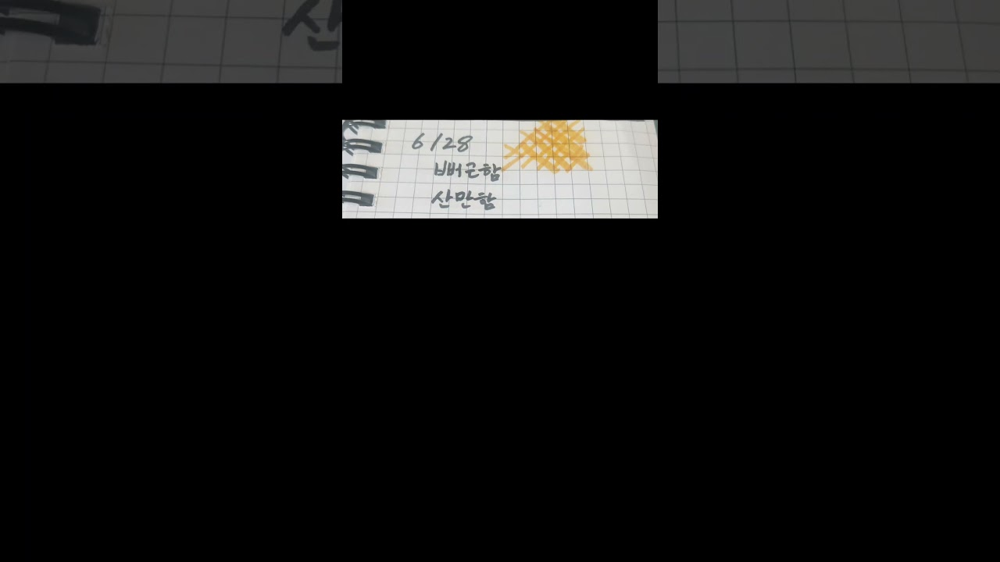

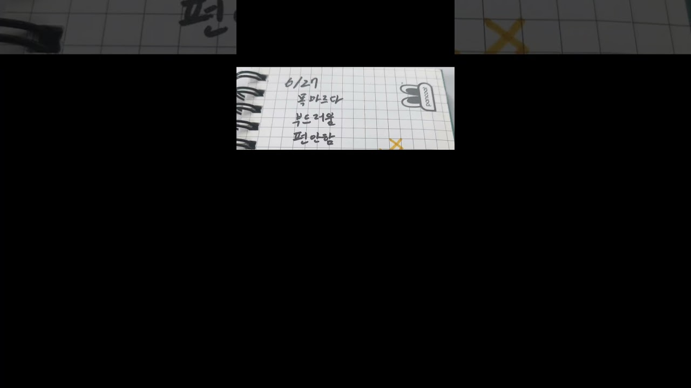

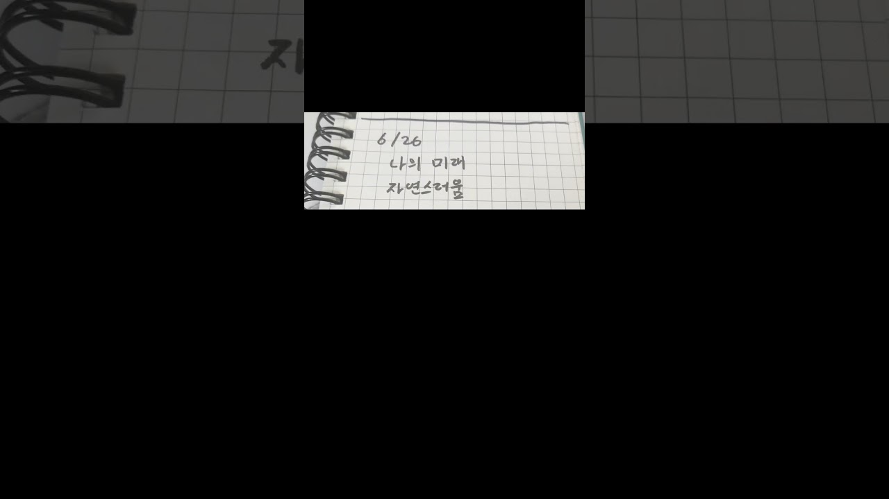

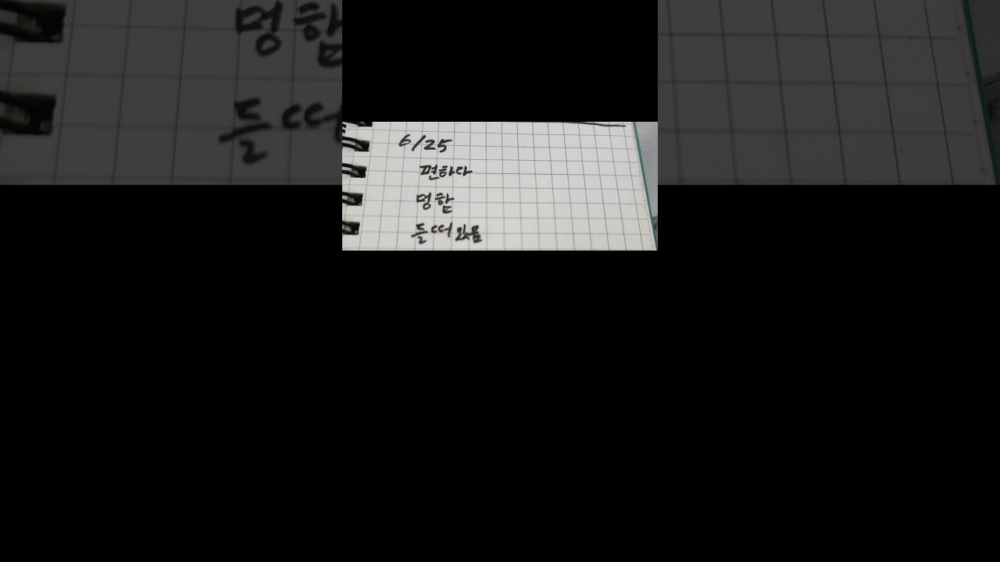

### [2025-07-07T08:29:32.132000+00:00] pappasco
명상을 한지도 한달이 되었다.
들떠있던 마음을 정리하는 시간이 좋아서 꾸준히 하게됨.
브로드웨이 42번가 탭츠프로브를 라이브로 봤는데 실제 뮤지컬 보고싶다.
인방서 하쁘라는 스트리머가 최유리 노래를 불러줬는데 가사가 좋았다.
좋은 인디밴드 (아월) 을 알게되었다. 좋은 발견이다.

070625일
오늘 루틴 올립니다. 배경음악은 녹황색사회 'Shout Baby' 입니다.
https://youtu.be/5fdzUwIolCE?feature=shared

070525토
오늘 루틴 올립니다. 배경음악은 아월 '무지개(รุ้ง)' 입니다.
https://youtube.com/shorts/dq6zYs59gYg?feature=shared

070425금
오늘 루틴 올립니다. 배경음악은 최유리 '사랑' 입니다.
https://youtube.com/shorts/jqrcxtT43S8?feature=shared

070325목
오늘 루틴 올립니다. 배경음악은 김민기 '아침 이슬' 입니다.
https://youtube.com/shorts/B0EDCPFPJq0?feature=shared

070225수
오늘 루틴 올립니다. 배경음악은 뮤지컬 브로드웨이 42번가 넘버 'Overtune - Audition' 입니다.
https://youtube.com/shorts/wJLr0OFeRZQ?feature=shared

070125화
오늘 루틴 올립니다. 배경음악은 god '길' 입니다.
https://youtube.com/shorts/FstD2oZZbkA?feature=shared

063025월
오늘 루틴 올립니다. 배경음악은 맘마미아 ost 'I Have A Dream' 입니다.
https://youtube.com/shorts/Q643XP51p0w?feature=shared
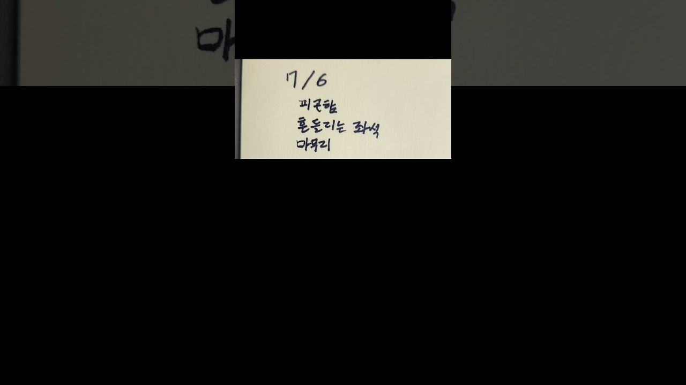

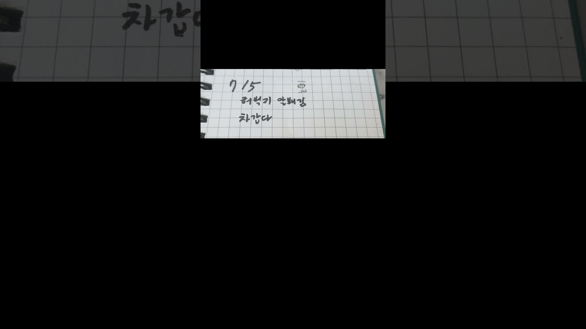

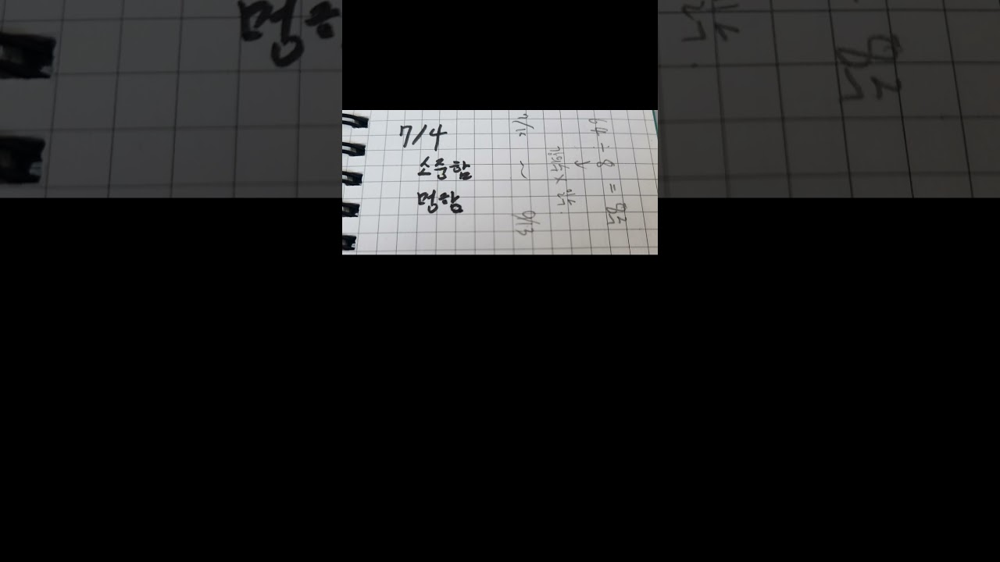

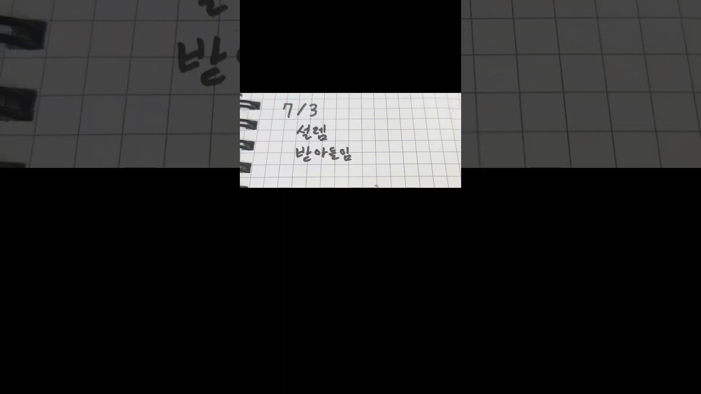

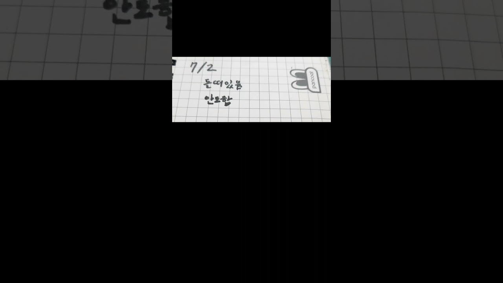

### [2025-07-13T21:09:02.323000+00:00] pappasco
071325일
오늘 루틴 올립니다. 배경음악은 아이묭 '마리골드' 입니다.
https://youtube.com/shorts/gD_lHUYtFzE?feature=shared
뜨거운 햇볕이 쬐는 여름같은 노래

071225토
오늘 루틴 올립니다. 배경음악은 하하 '공백' 입니다.
https://youtube.com/shorts/Dalkk9Ystkc?feature=shared
나는 내삶을 내가 잘 알아봐주고 있는가

071125금
오늘 루틴 올립니다. 배경음악은 이무진 '청춘만화' 입니다.
https://youtube.com/shorts/oZLwPkU1CtI?feature=shared
올해 처음 들었던곳. 가사가 좋음. 날아오르자 뛰어오르자.

071025목
오늘 루틴 올립니다. 배경음악은 Imagine Dragons 'Walking The Wire' 입니다.
https://youtube.com/shorts/PX5a3l-Lo1g?feature=shared
갤럭시 언팩했길래 갤럭시 s9 광고음악 갖고옴. 몰랐는데 좋다.

070925수
오늘 루틴 올립니다. 배경음악은 럼블피쉬 '예감 좋은 날' 입니다.
https://youtube.com/shorts/7jzuDjTa15s?feature=shared
적당한 리듬감. 알고보니 헤어지는 날이였음 ㅠ

070825화
오늘 루틴 올립니다. 배경음악은 Mr. Belt & Wezol 'It's Not Right (But It's Okay)' 입니다.
https://youtube.com/shorts/G0tUinDG5r4?feature=shared
아무튼 해낸다 좋다

070725월
오늘 루틴 올립니다. 배경음악은 송소희 'Not a Dream' 입니다.
https://youtube.com/shorts/DvT5ombZ-tI?feature=shared
월요일은 아침형인간 시작.
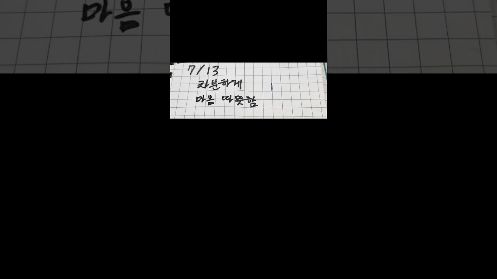

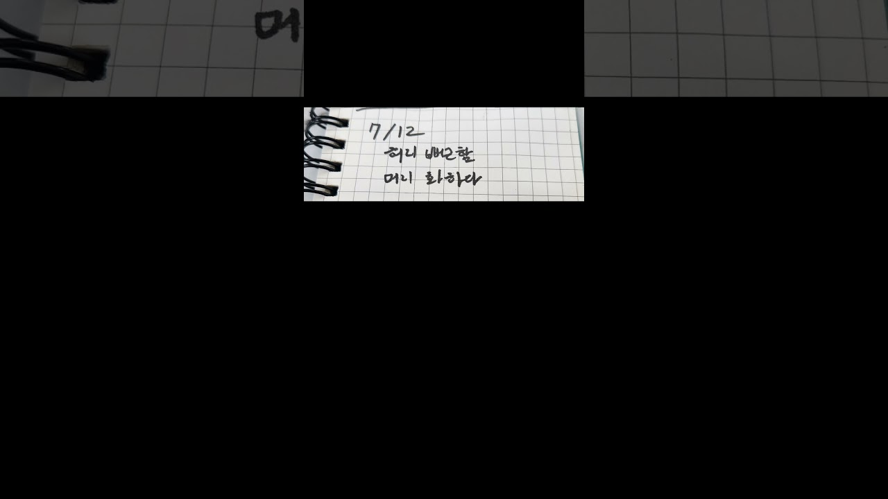

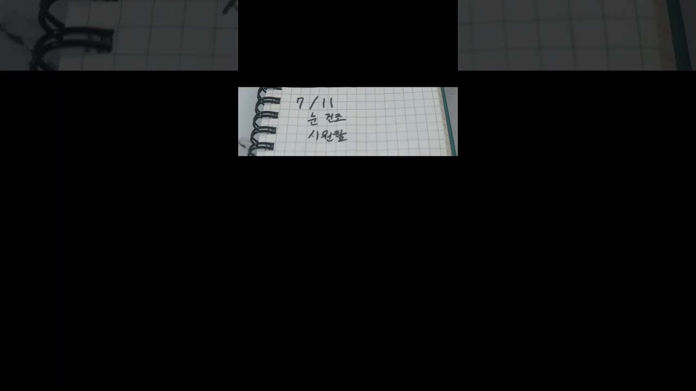

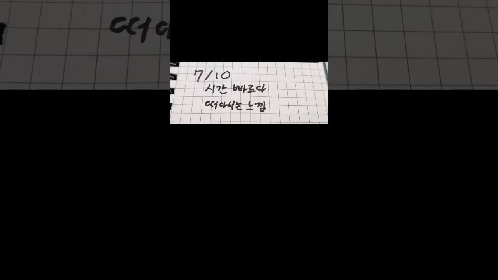

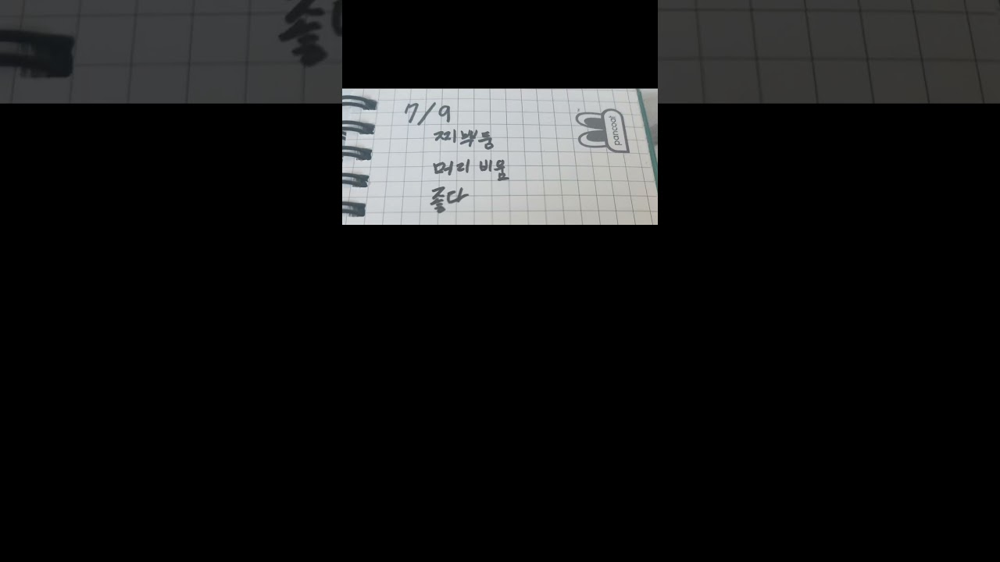

### [2025-07-20T20:18:56.980000+00:00] pappasco
072025일
https://youtube.com/shorts/dqIzNPE68uA?feature=shared
우리는 열심히 날갯짓을 해, Alexandros -철새(ワタリドリ)
오늘도 열심히 내 길을 걷자

071925토
오늘 루틴 올립니다. 저도 마음에 와닿은 명연을 적어봤습니다. 조셉 골드스타인 명상 지도자의 말을 인용했습니다.
https://youtube.com/shorts/PIb-cC6R5_c?feature=shared
마야 - 나를 외치다 
갑자기 생각난 내 인생곡. 나의길 잘있나?

071825금
오늘 루틴 올립니다. 배경음악은 리진 'better' 입니다.
https://youtube.com/shorts/Pz-vCKM_5go?feature=shared
비오는날 듣기좋은 좋아하는 가수 자작곡

071725목
오늘 루틴 올립니다. 배경음악은 F1 더 무비 삽입곡 돈 톨리버 'Lose My Mind' 입니다.
https://youtube.com/shorts/aPpVC0ttBEc?feature=shared

071625수
오늘 루틴 올립니다. 배경음악은 헤이즈 'And July' 입니다.
https://youtube.com/shorts/L3K9Liwskz0?feature=shared
7월하면 나올 노래

071525화
오늘 루틴 올립니다. 배경음악은 마이 케미컬 로맨스 'Welcome To The Black Parade' 입니다.
https://youtube.com/shorts/PTJdRyBZAGs?feature=shared
내한티켓 예매 성공~

071425월
오늘 루틴 올립니다. 배경음악은 터치드 '새벽별' 입니다.
https://youtube.com/shorts/6cYJAWE62ms?feature=shared
새벽에 일어나는 날. 벌써 환하다.
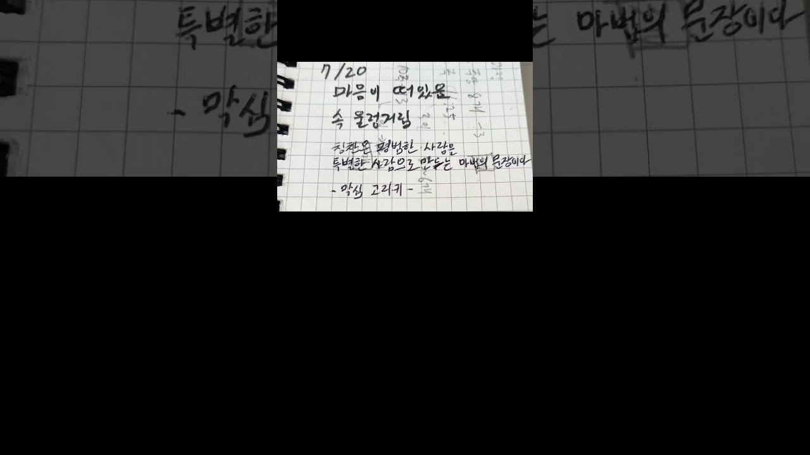

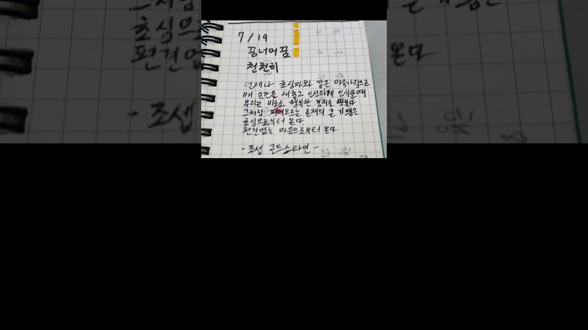

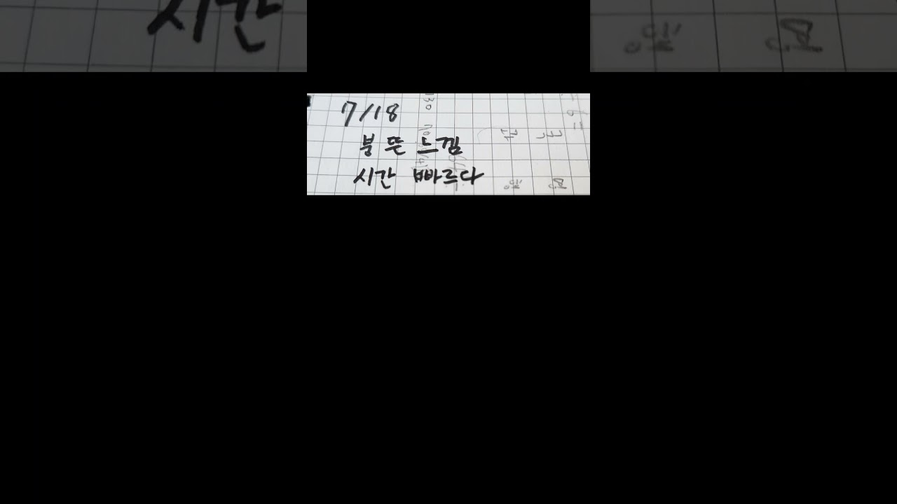

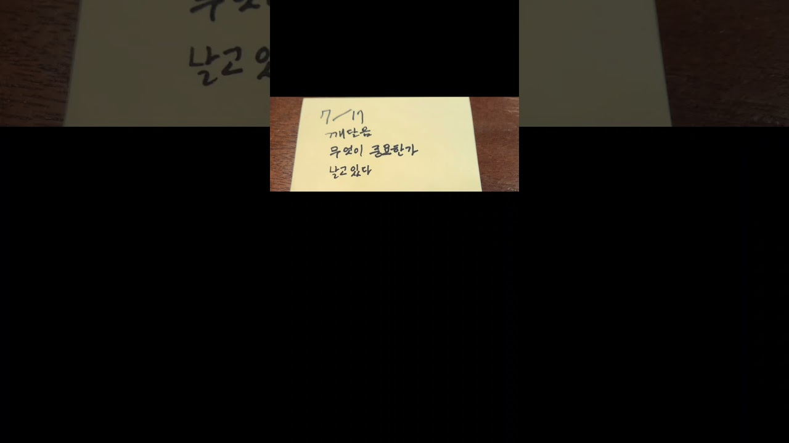

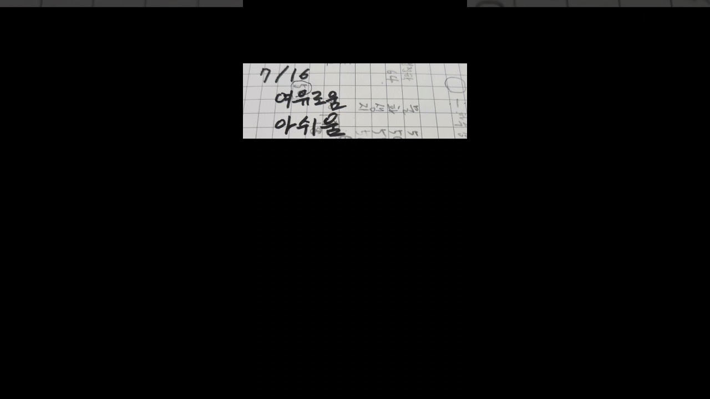

### [2025-07-28T01:31:33.343000+00:00] pappasco
072725일
https://youtube.com/shorts/nHq5qEynn-0?feature=shared
마츠다 세이코 - 푸른산호초
가족여행이 끝났다. 후 정말 폭풍같이 호로록 끝나버렸어.

072625토
https://youtube.com/shorts/5OC6h5qMTTc?feature=shared
윤종신 - 고속도로로망스
출발 전 명상. 여행갈땐 이노래지.

072525금
https://youtube.com/shorts/9lPn_GDREvw?feature=shared
김동률  - 출발
가족여행간다! 신난다

072425목
https://youtube.com/shorts/iF9IVAVSjVU?feature=shared
예민 - 산골소년의 사랑이야기
따뜻한 노래. 옛날 시골갔던게 생각남.

072325수
https://youtube.com/shorts/lZx5X5VPi14?feature=shared
딕펑스 - VIVA청춘
반짝이는 청춘 자랑하기

072225화
https://youtube.com/shorts/hZXijHJUVFw?feature=shared
이상은(Lee Sang Eun) - 비밀의 화원
어제 문득 생각남. 난 다시 꿈을 꾸게 되었어.

072125월
https://youtube.com/shorts/U7I9OJltyVw?feature=shared
장범준 - 여름밤에 오! 사랑의 멜로디 (Oh! Summer night, Romantic Melodies)
브레드가 미국간다니 아쉽다. 버스커버스커 좋다.
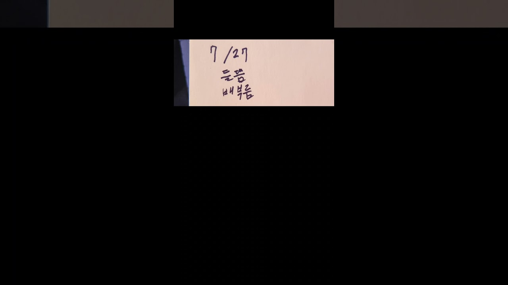

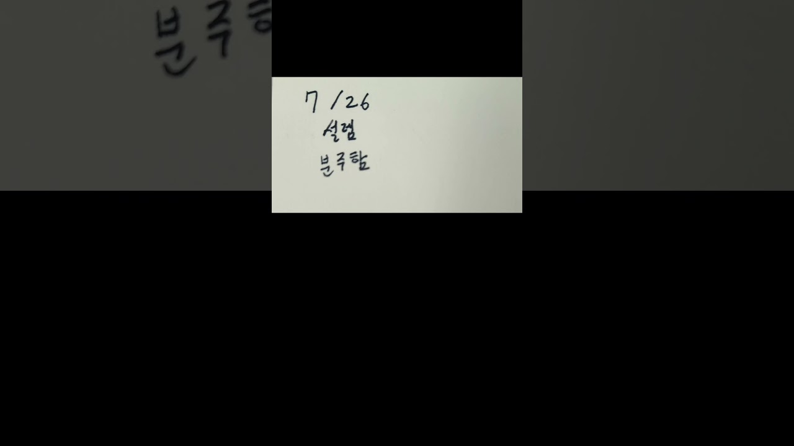

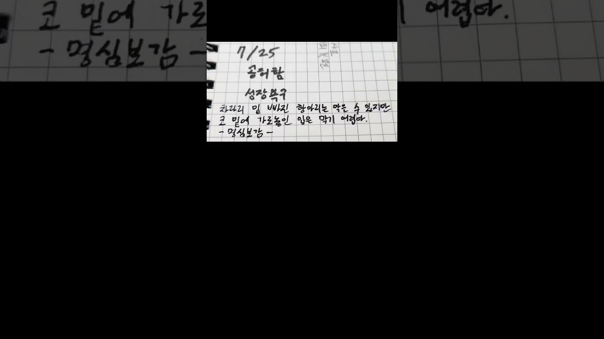

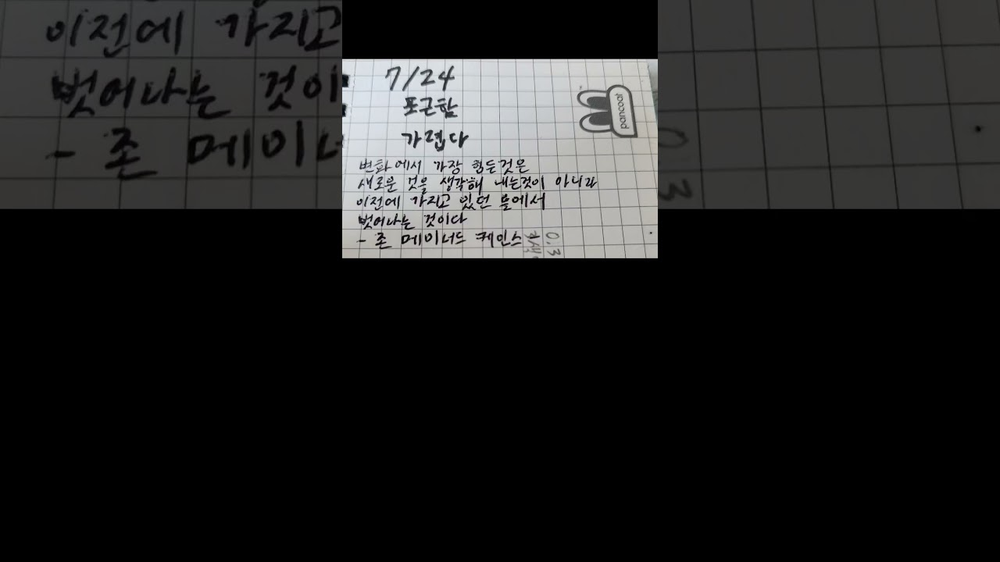

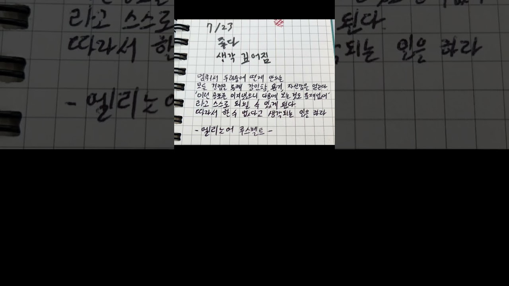

### [2025-08-05T01:48:23.530000+00:00] pappasco
080325일
https://youtube.com/shorts/pkwqDPjagY8?feature=shared
TUBE 'The Season In The Sun'
좋은 사람들이였구나. 내가 너무 몰랐구나.

080225토
https://youtube.com/shorts/3tB88iiJdPo?feature=shared
볼빨간사춘기 '여행'
계곡 가는날이다. 살짝 설렌다. 과연 어떨지.

080125금
https://youtube.com/shorts/Q3Qu1Vwq5u4?feature=shared
윤종신 'Summer Seoul'
이번 월간윤종신 맘에든다.

073125목
https://youtube.com/shorts/9SzTolcIKlQ?feature=shared
조용필 '그래도 돼'
이제는 믿어봐 자신을 믿어봐. 뮤비확장판이 더좋아.

073025수
https://youtube.com/shorts/Xeijcwcy6kM?feature=shared
Gym Class Heroes (feat. Adam Levine) 'Stereo Hearts'
음 하나하나에 담긴 마음

072925화
https://youtube.com/shorts/6iRur57mfsI?feature=shared
Drunken Tiger '소외된 모두, 왼발을 한 보 앞으로!'
보여주겠다. 모든게 마이웨이.

072825월
https://youtube.com/shorts/W1Xhcui_Ido?feature=shared
DAY6(데이식스) '행복했던 날들이었다'
즐거웠다. 여행마무리 노래.
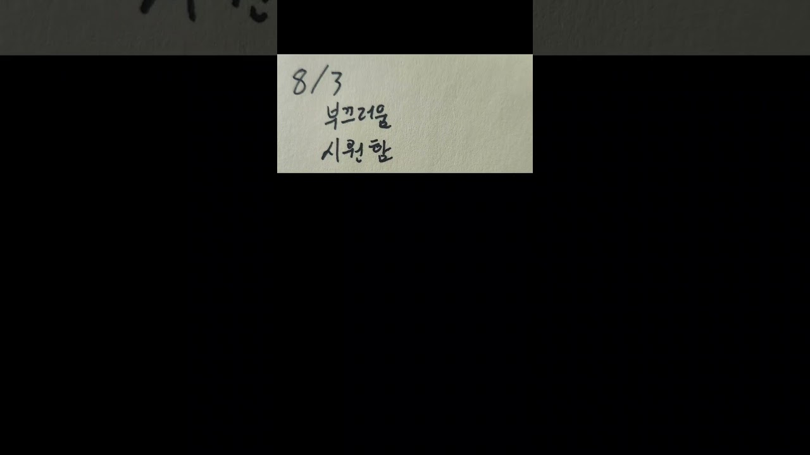

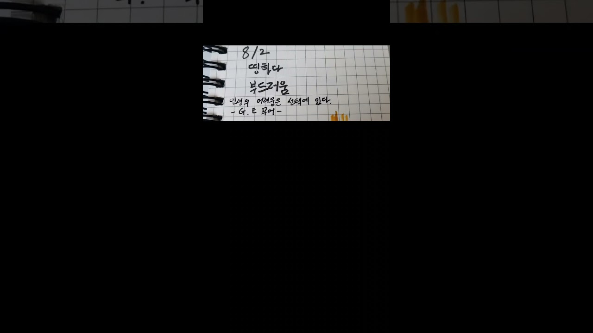

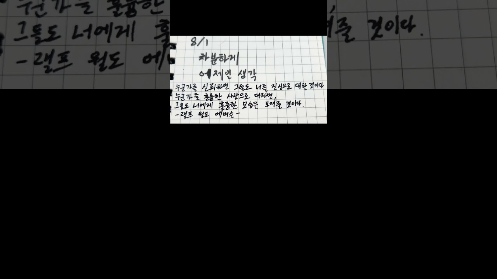

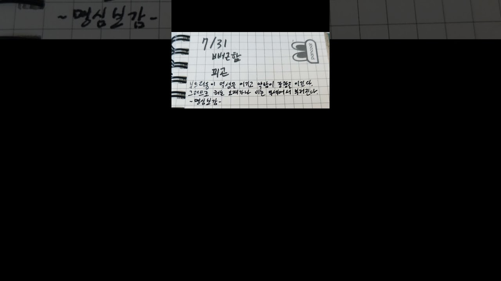

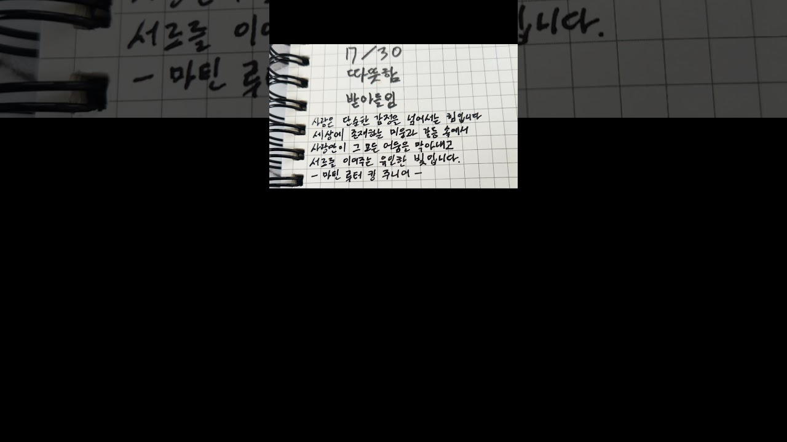

### [2025-08-19T01:00:23.324000+00:00] pappasco
081725일
https://youtube.com/shorts/qG3wB3vBu0A?feature=shared
케데헌ost 'Golden'
대단한 인기다. 케이팝이 세계로. 우린 마치 금처럼 빛나게 될거야.

081625토
https://youtube.com/shorts/6sJ3HzZme0Y?feature=shared
카라 '루팡'
대학생때 처음들었던 추억의노래. 놀러갈때 듣기좋음

081525금
https://youtube.com/shorts/0riMEyvTC_E?feature=shared
김광석 '너무 깊이 생각하지마'
운산스님 나오는 다큐 브금. 자기 할 일은 스스로 해야지. 남이 시키는일을 한다는건 무지힘든 일이다 그게 자기일이 아니니까.

081425목
https://youtube.com/shorts/qWYZqpm-YTY?feature=shared
하하 '키 작은 꼬마 이야기'
명상에 나온 어린아이 둘과 할수있다는 마음이 생각나서 이곡 생각남

081325수
https://youtube.com/shorts/X7NJ7p6QzeY?feature=shared
롤러코스터 '습관'
비오는 아침에 맞는 전주

081225화
https://youtube.com/shorts/8SkrPdy9E14?feature=shared
어반자카파 'Go Get'
망설여 바보같이 그냥 좀 해도 돼 한번쯤 미친 사람처럼

081125월
https://youtube.com/shorts/ayj5NXuERr0?feature=shared
패티김 '사랑은 생명의 꽃'
마음이 느껴지는 노래. 대단한 가수.

081025일
https://youtube.com/shorts/UGOJFHj0p6M?feature=shared
Hump Back '친애하는 소년이여'
꿈은 이제 꾸지 않는 거야? 내 미래를 생각하며

080925토
https://youtube.com/shorts/kJ6gKKxrRRY?feature=shared
카더가든 '가까운 듯 먼 그대여'
가까워보여도 먼건지 가깝지만 내가 멀게 느끼는건지

080825금
https://youtube.com/shorts/pPsANfNEk_E?feature=shared
WAX 왁스 '내게 남은 사랑을 다 줄게'
중학교때 펌프에서 본 노래. 다시 들으니 전주기타가 좋네.

080725목
https://youtube.com/shorts/2zXES8UeGRw?feature=shared
이찬혁 '멸종위기사랑'
한삶당 하나의 사랑이 있었대.

080625수
https://youtube.com/shorts/7DyKaL92bxI?feature=shared
블랙핑크 '마지막처럼'
오늘은 오늘이 마지막이다.

080525화
https://youtube.com/shorts/AvdVKe0wecU?feature=shared
OneRepublic 'I Ain't Worried'
여운이 남는.

080425월
https://youtube.com/shorts/zR4gxqKPF8U?feature=shared
SEVENTEEN(세븐틴)  'Holiday'
이렇게 놀면 더 재밌었겠다
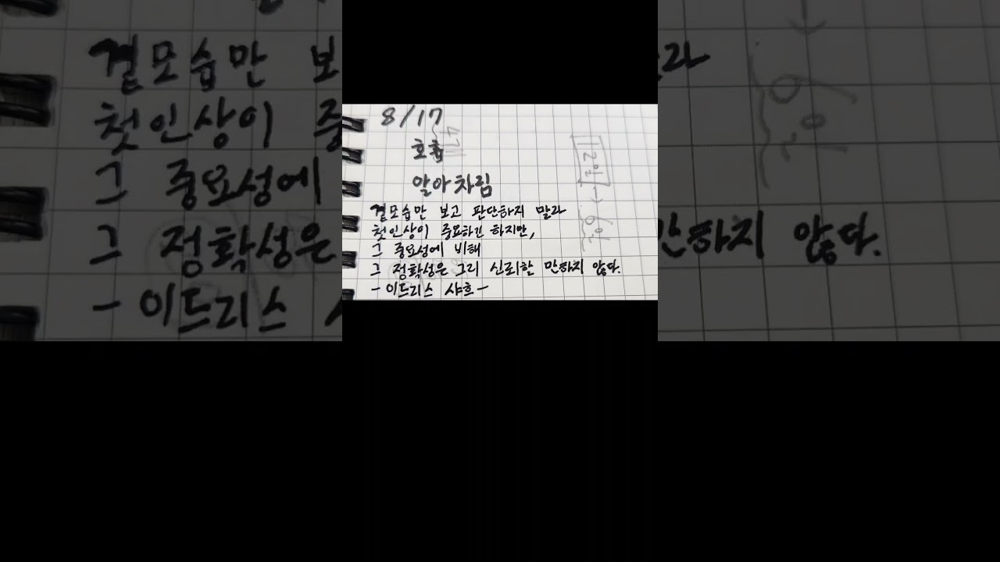

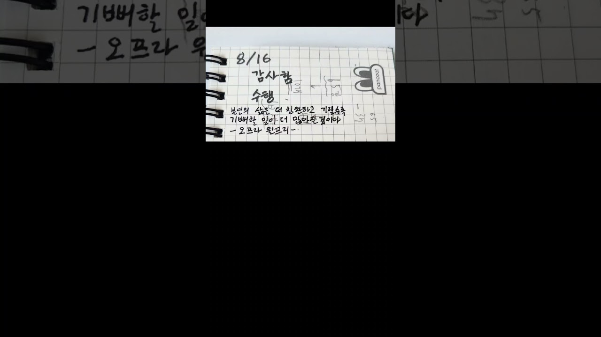

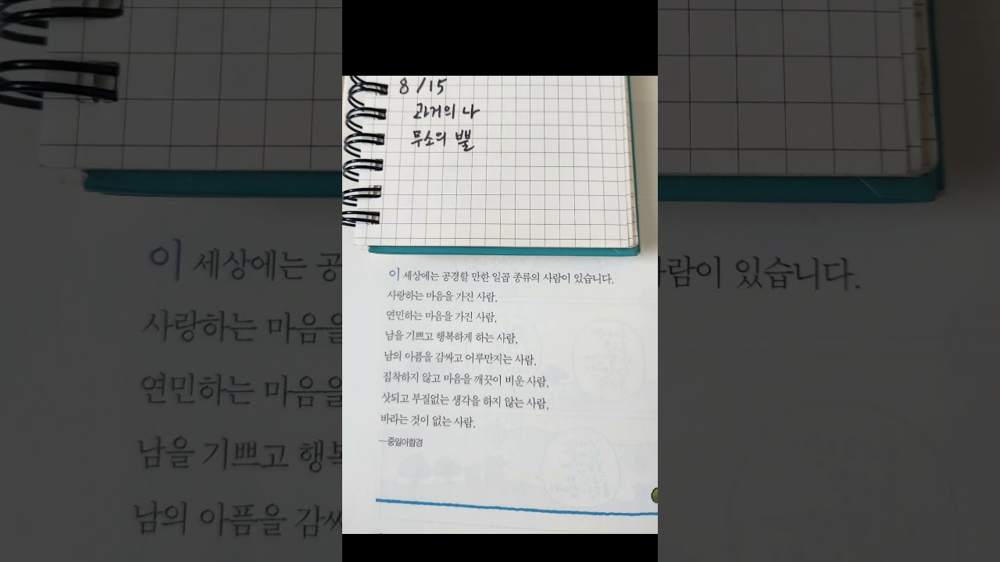

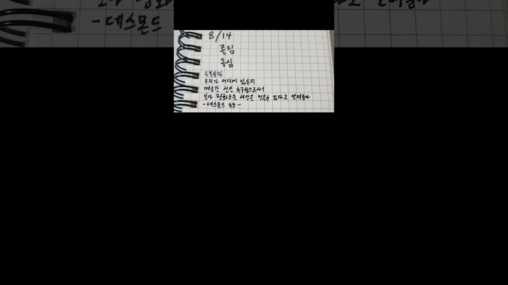

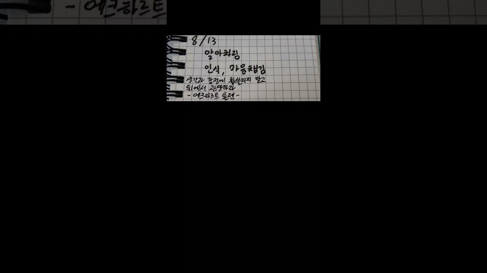

### [2025-08-25T02:32:16.098000+00:00] pappasco
082425일
https://youtube.com/shorts/MZF8ntCcDYM?feature=shared
걸밴크 삽입곡 토게나시 토게아리 '혼잡한 길, 우리의 도시'
밴드 해볼까

082325토
https://youtube.com/shorts/UDO9fw1OyjA?feature=shared
이문세 '깊은밤을 날아서'
우리들 날지도 못하고 울지만 사랑은 아름다운 꿈결처럼

082225금
https://youtube.com/shorts/th3vDBGcN_Q?feature=shared
10cm '너에게 닿기를'
다큐 3일 안동역 살짝기대중.

082125목
https://youtube.com/shorts/fTBWbGffBHw?feature=shared
F1 The Movie 삽입곡 Ed Sheeran 'Drive' 
광음시네마관에서 한번더봤다. 가슴을 치는 엔진소리.

082025수
https://youtube.com/shorts/c5slO7mA670?feature=shared
비비 '아주, 천천히'
비비가 이렇게 따뜻한 노래를 불렀다니.

081925화
https://youtube.com/shorts/0CdbrmMaHgc?feature=shared
죠죠 죠르노 죠바나 테마곡 'il vento d'oro'
각오는 됐나? 난 되어있다

081825월
https://youtube.com/shorts/NdvHYrJycO0?feature=shared
박진영 '날 떠나지마'
국중박 곤룡포 사러왔다. 살수있을까.
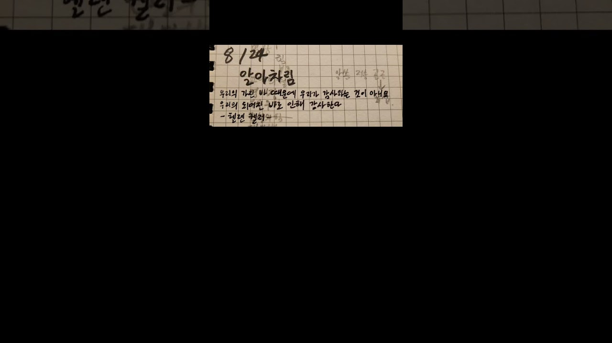

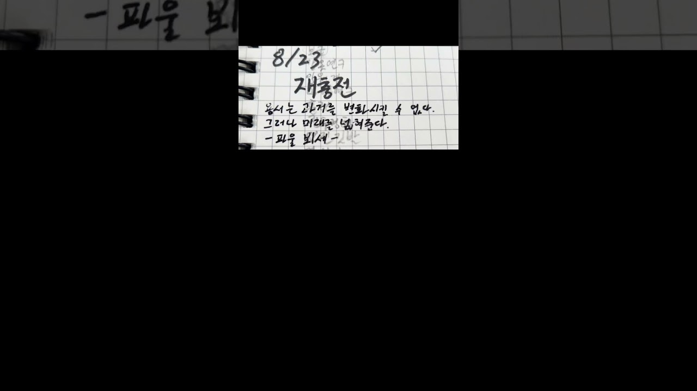

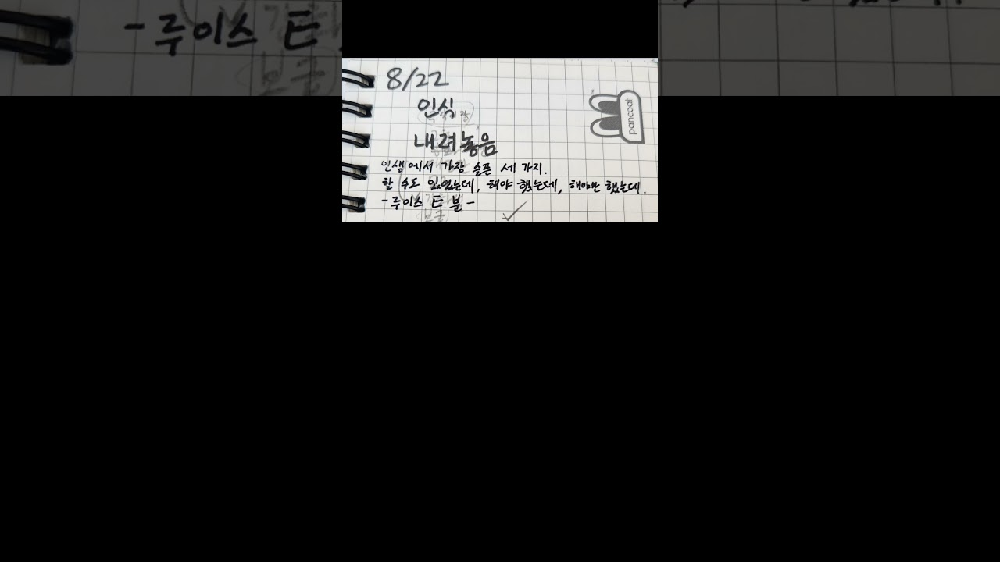

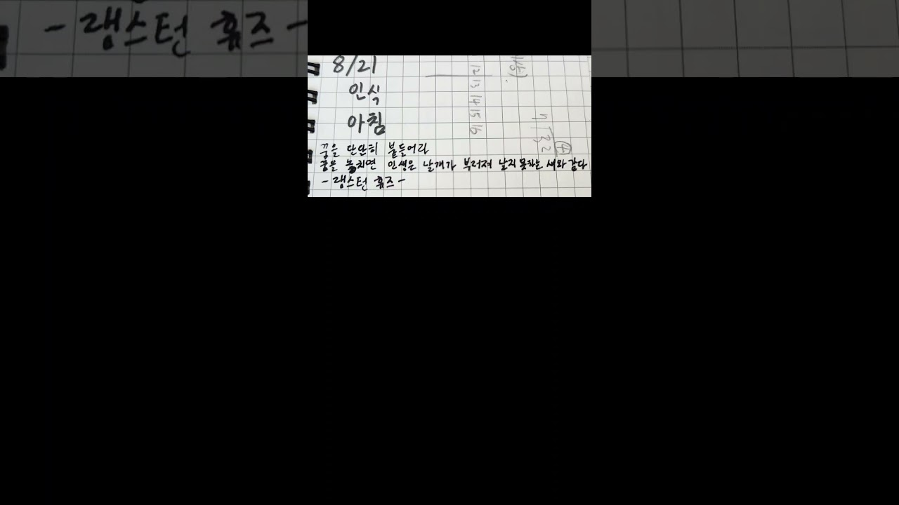

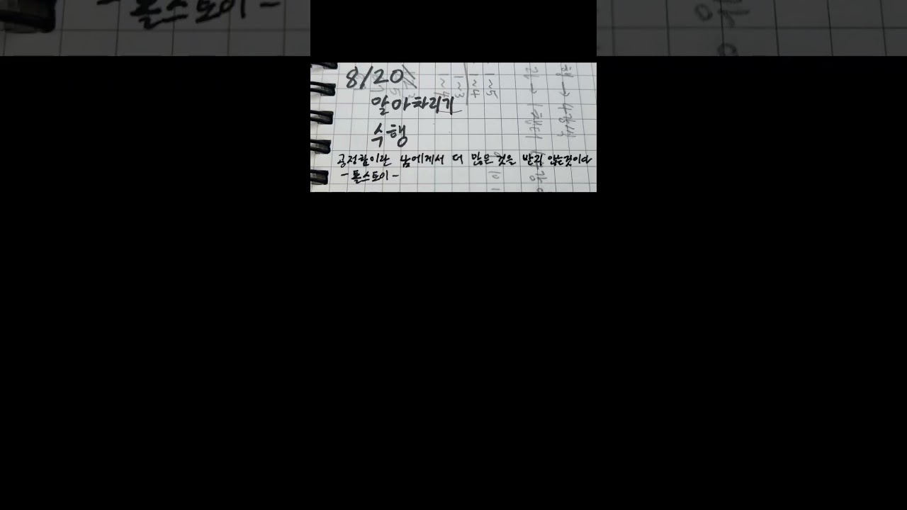

### [2025-09-02T03:18:24.901000+00:00] pappasco
083125일
https://youtube.com/shorts/1mkgg7EFC4w?feature=shared
미세스 그린 애플 '점묘의 노래' 
Mrs. GREEN APPLE '点描の唄' (feat.井上苑子)
오늘을 깨물고 있자. 끝나지 않았으면 좋겠지만 시간은간다 아쉬워

083025토
https://youtube.com/shorts/2XOJwtGgH-Y?feature=shared
오아시스 'Morning Glory'
좋아하는걸 하고 살수있다는걸 보여주고 나도 할수있단걸 배우고

082925금
https://youtube.com/shorts/wBE7K_ub5es?feature=shared
한로로 '시간을 달리네 (Goodbye, My Summer)'
여름이 끝나간다.

082825목
https://youtube.com/shorts/lzK57mIqQgo?feature=shared
잔나비 '뜨거운 여름밤은 가고 남은 건 볼품없지만'
또다시 찾아오는 누군갈 위해서 남겨두겠소

082725수
https://youtube.com/shorts/seiEy5FHmCE?feature=shared
잔나비 '사랑하긴 했었나요 스쳐가는 인연이었나요 짧지않은 우리 함께했던 시간들이 자꾸 내 마음을 가둬두네'
그대여 다시 내게 마음을 주오 ohoh

082625화
https://youtube.com/shorts/coWWNE2F3e8?feature=shared
헤이즈 '비도 오고 그래서'
비가 계속 온다

082525월
https://youtube.com/shorts/JPLUG06fGgQ?feature=shared
시그널 삽입곡 김윤아 '길'
시그널 재밌었다
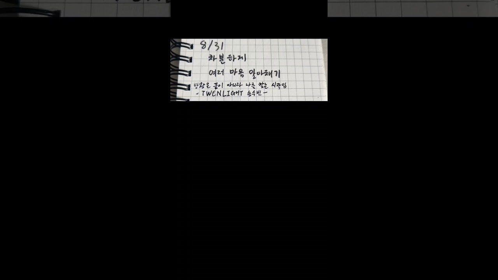

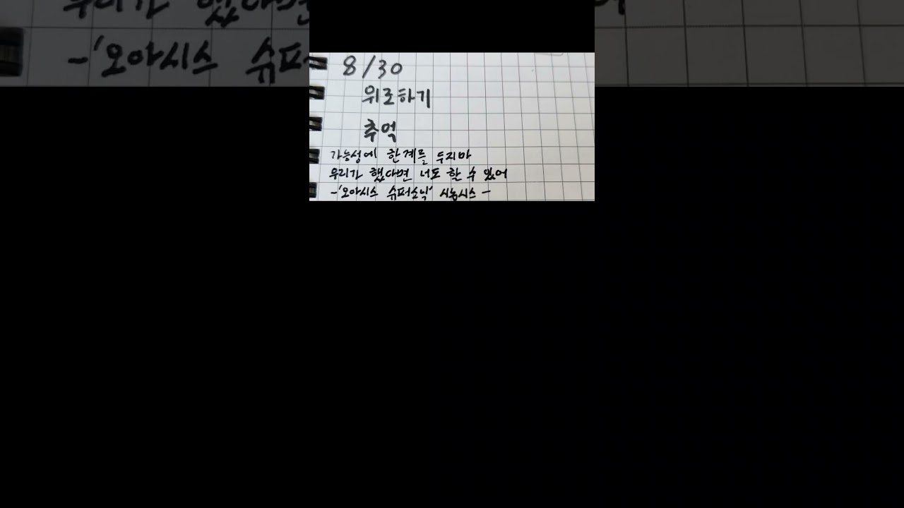

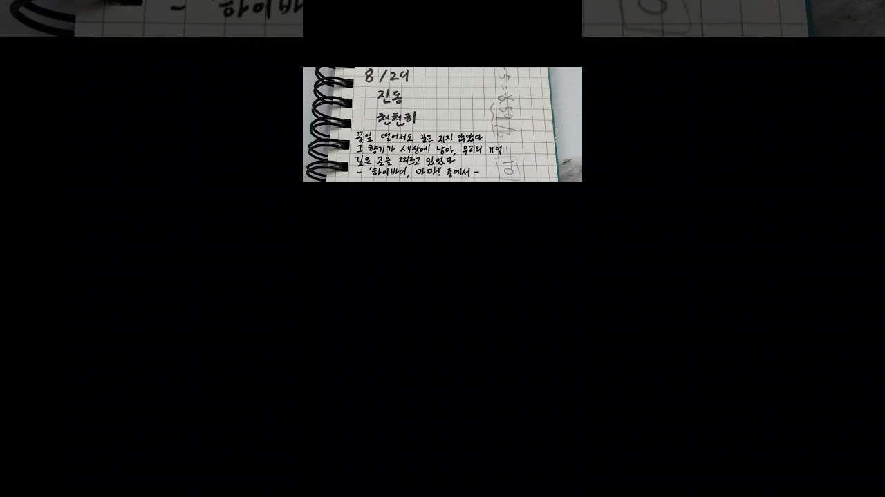

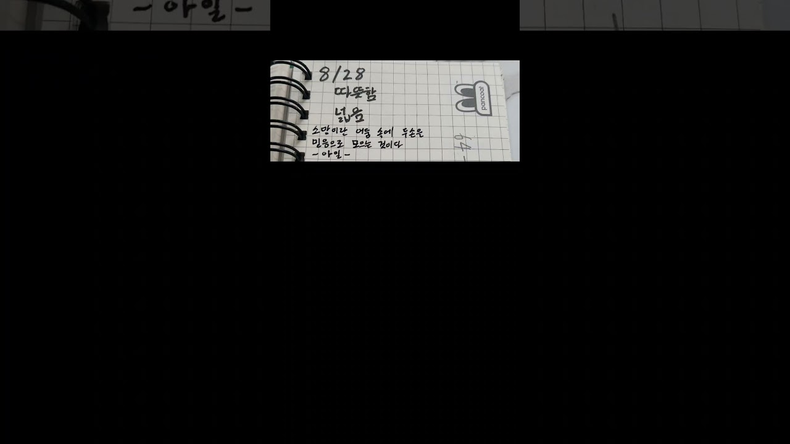

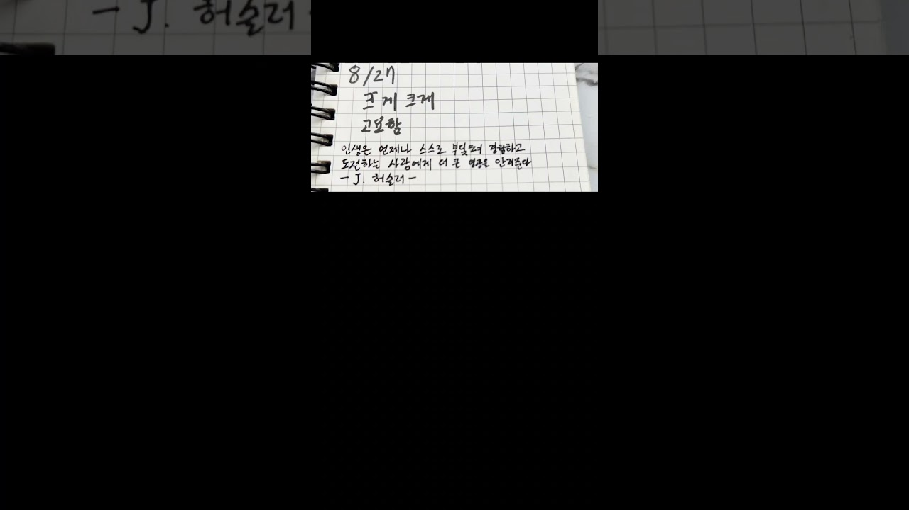

### [2025-09-05T21:43:23.398000+00:00] pappasco
090624토
https://youtube.com/shorts/Z8FFoJAyOX0?feature=shared
Queen 'We Are The Champion'
재도전선포 하면 나온 엔딩노래. 우리는 챔피언이다.

090525금
https://youtube.com/shorts/g4-2bzhr01Q?feature=shared
노라조 '형'
재도전학교 단톡 추천곡. 오늘도 어깨 피고 버터보자.

090425목
https://youtube.com/shorts/aZzwVLosz3o?feature=shared
에픽 하이 '우산'
비 오면 이 노래. 가을이 오는가 보다.

090325수
https://youtube.com/shorts/3KcOdpQxE5g?feature=shared
이츠 '청록'
예전부터 좋아하는 노래. 시원한 여름이 생각남.

090225화
https://youtube.com/shorts/16HMm0HNI3g?feature=shared
10cm '노을'
미지의서울 엔딩곡. 좋다 목소리가 노래랑 맞는다.

090125월
https://youtube.com/shorts/c_HlYhKmOzI?feature=shared
aespa 커버 'Dreams Come True'
꿈아 이뤄져라
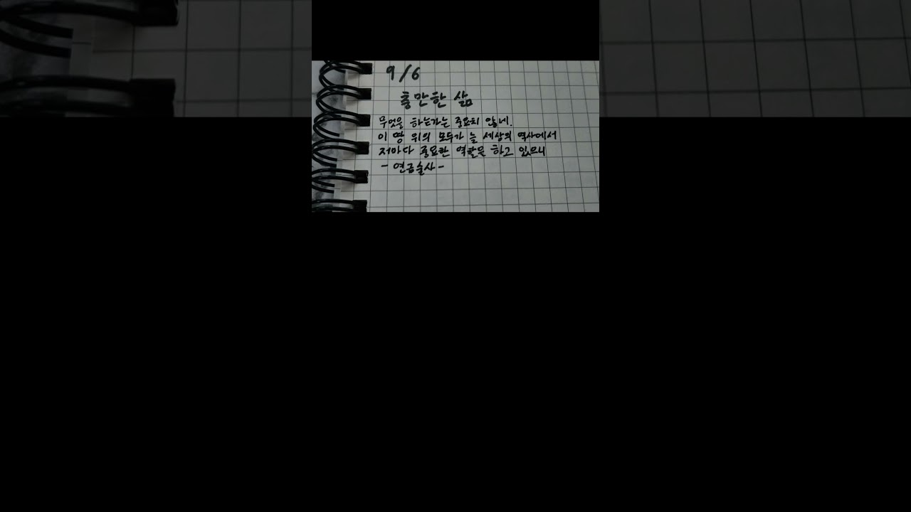

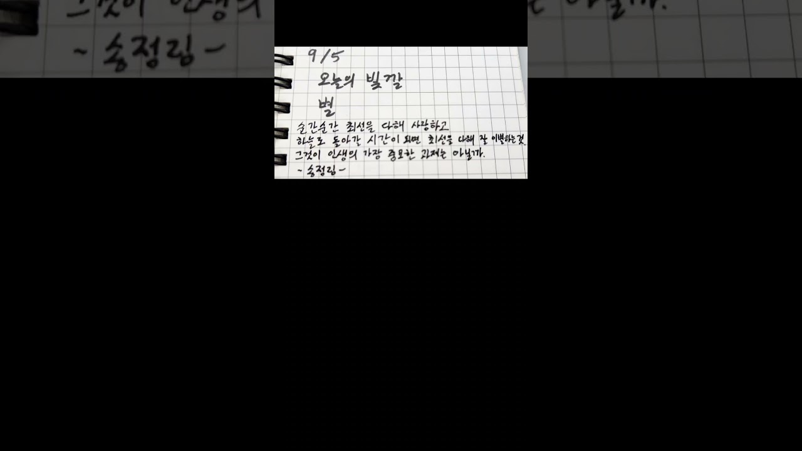

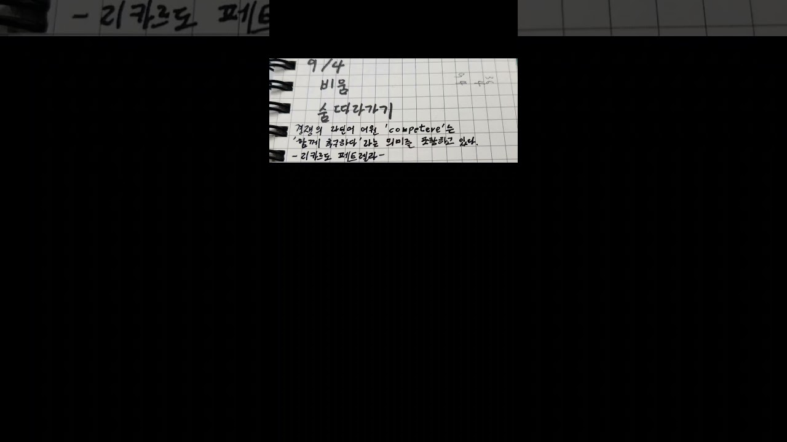

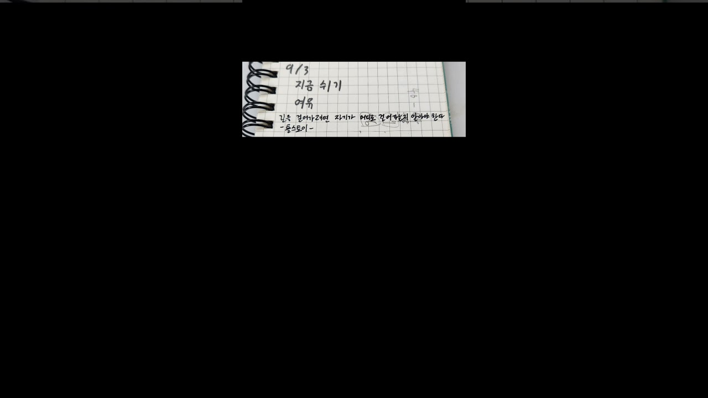

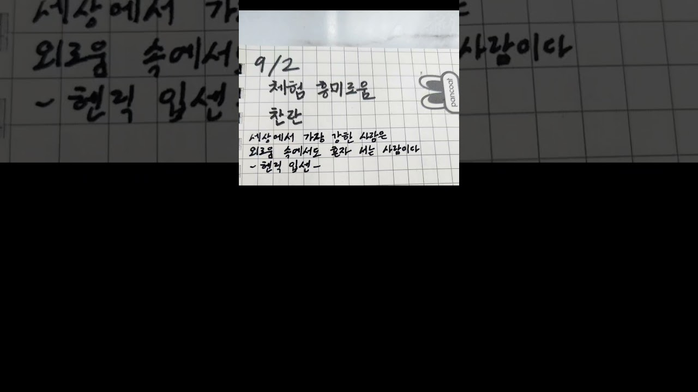

### [2025-09-07T01:56:06.602000+00:00] pappasco
090725일
https://youtube.com/shorts/F1w39_qa0YA?feature=shared
오피셜히게단디즘 '115만 킬로의 필름'
인생은 80년치 필름. 좋은 비유다.
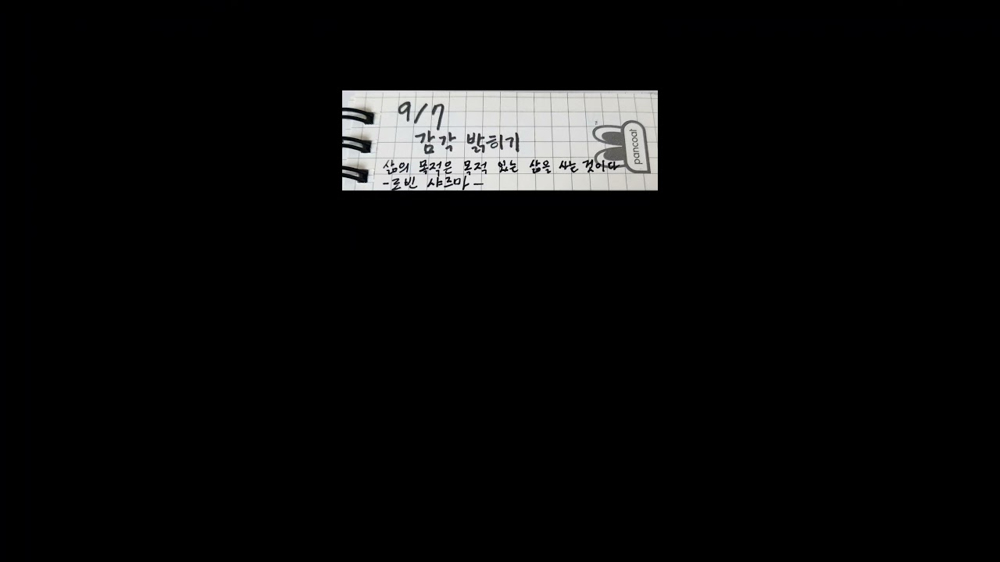

### [2025-09-13T21:32:37.890000+00:00] pappasco
091425일
https://youtube.com/shorts/xxN8SBw9HJ8?feature=shared
쿠보타 토시노부 (Toshinobu Kubota) 'La La La Love Song'
오랫만에 결혼식장서 들음. 어제 밴드 잘하더라.

091325토
https://youtube.com/shorts/MJgeNTlwMJU?feature=shared
박기영 '시작'
시작을 축하드립니다.

091225금
https://youtube.com/shorts/uxVgsMGoeik?feature=shared
조승우 '지금 이 순간' (뮤지컬 지킬앤하이드)
내가 유일하게 사용할수 있는것은 지금 이 순간 뿐이다. 출근길 명상에서 이야기함.

091125목
https://youtube.com/shorts/6h3wbp8fnDU?feature=shared
이적 '빨래'
어제 운동화 빨래를 했다. 개운했다. 다른일도 해야 하는데.

091025수
https://youtube.com/shorts/it6kq8QTcTs?feature=shared
페퍼톤즈 'Superfantastic'
전주가 아주 좋음

090925화
https://youtube.com/shorts/pgkjTGD4DD0?feature=shared
박은빈 '눈을 감고 열을 센다면'
엄청 좋다. 멜로디랑 노래가 찰떡.

090825월
https://youtube.com/shorts/RVG3HxDBTGc?feature=shared
아이유 'Celebrity'
구부정 하게 커버린 나
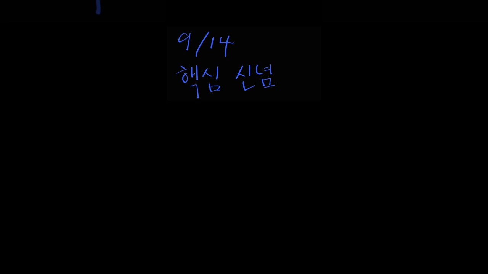

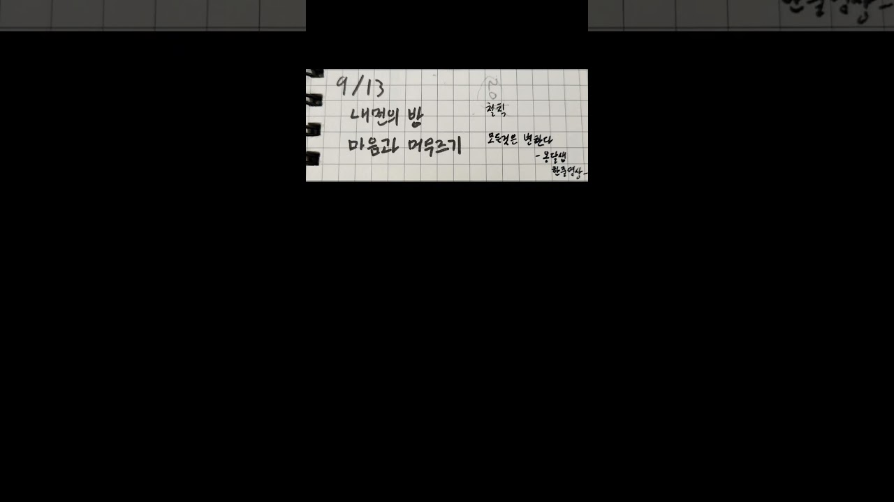

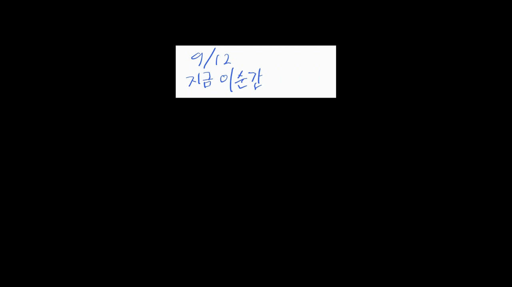

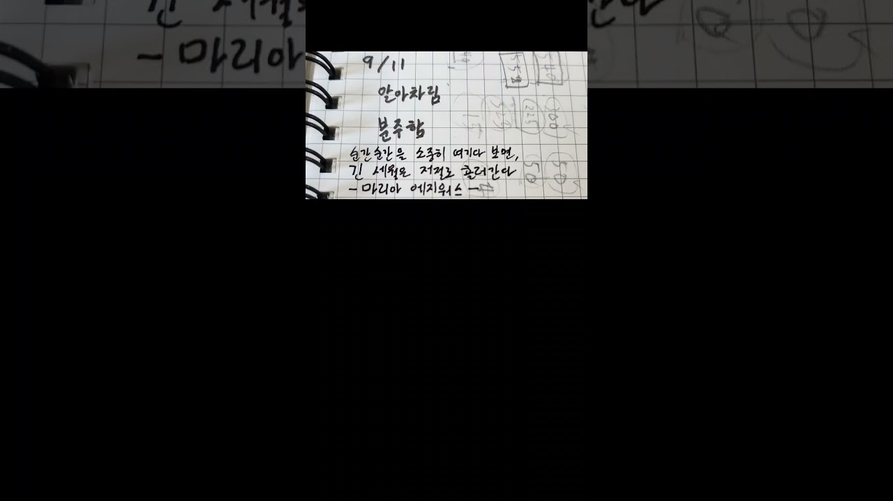

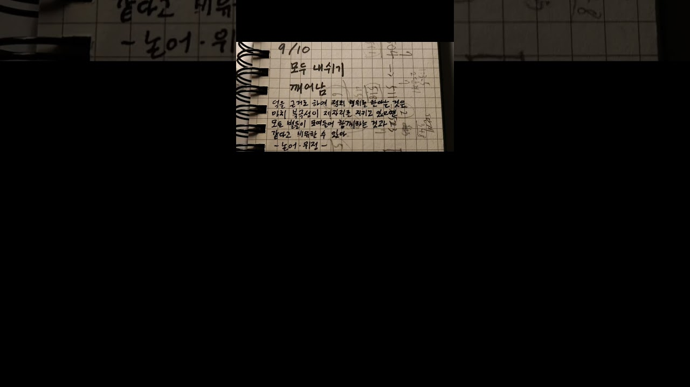

### [2025-09-20T21:49:10.932000+00:00] pappasco
092125일
https://youtube.com/shorts/FIEXSPB_ZXY?feature=shared
요아소비 '삼원색'
젤다 매드무비에서 들었다. 참 좋아.

092025토
https://youtube.com/shorts/YCJ3f8AQxnA?feature=shared
우효 '민들레'
고용센터 심리상담받고 나오는길에 들었는다. 살짝 울적했다.

091925금
https://youtube.com/shorts/CMPZixVQbFo?feature=shared
Imagine Dragons 'Walking The Wire'
돌아설수도 있지만 받아들일거야

091825목
https://youtube.com/shorts/gJTAqX7FRV4?feature=shared
김한울 '아 오늘은'
피곤하다. 노래처럼 늘어지고싶다.

091725수
https://youtube.com/shorts/SmTQPxwgofE?feature=shared
더 파이팅 OST '저녁 하늘의 종이비행기'
지금보다 강해지는 내가 되었으면

091625화
https://youtube.com/shorts/0wn1F3MDqNw?feature=shared
G-DRAGON  'HOME SWEET HOME'
게임하면서 많이 듣게됨. 집이 좋아.

091525월
https://youtube.com/shorts/tqJHPxpGmc4?feature=shared
심규선 '살아남은 아이'
가사가 좋다. 좋은 말이다.
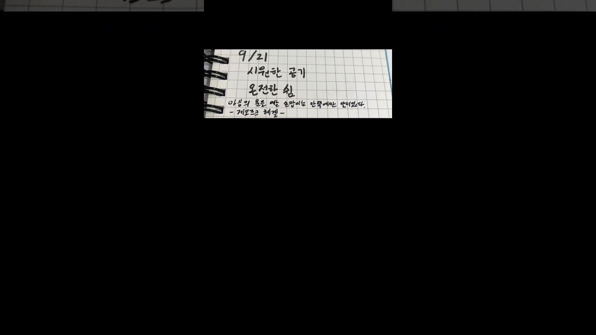

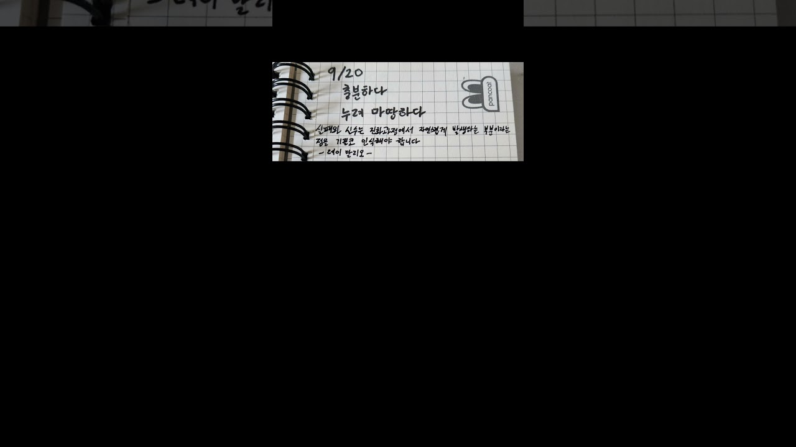

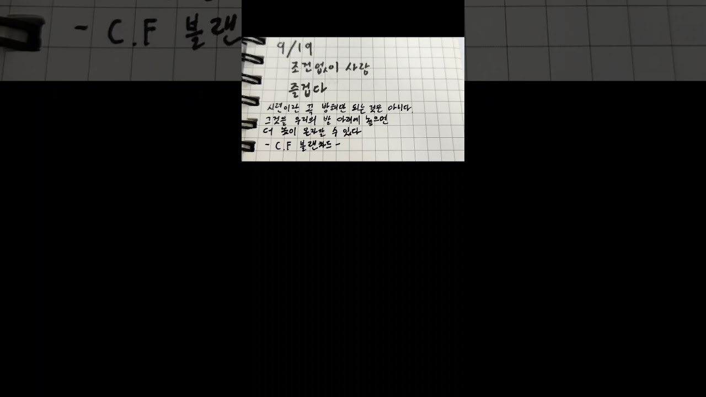

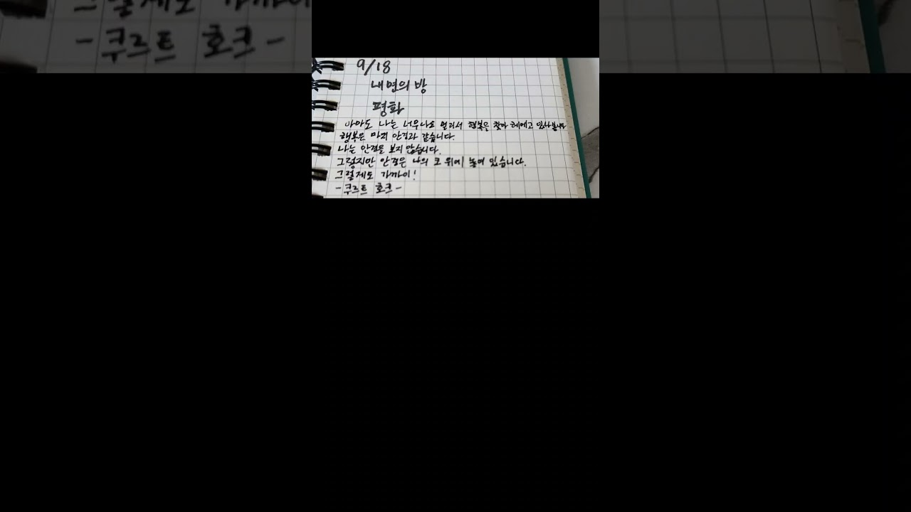

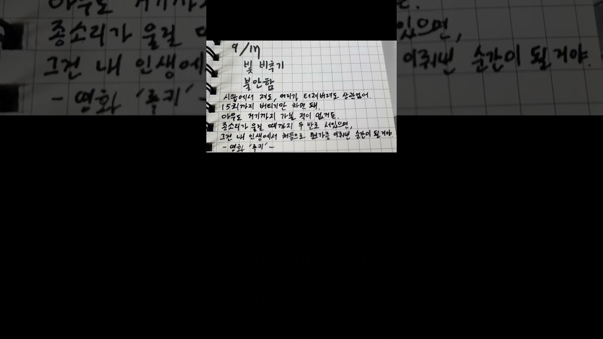

### [2025-09-28T04:29:36.487000+00:00] pappasco
092825일
https://youtube.com/shorts/9X-8AW9hovM?feature=shared
JVKE 'golden hour'
내 미래일기에 썼던 노래가 2025서울불꽃축제에 수록곡으로 나왔다. 지금까지 인생을 정리하는 기분이다.

092725토
https://youtube.com/shorts/HCBbhimPSh0?feature=shared
이키모노가카리 (나루토 엔딩 op) 'Blue Bird'
옛날 애니 볼때 생각난다. 날개를 펼치면 푸르디 푸른 저 하늘. 

092625금
https://youtube.com/shorts/Vyf6yt0XCuQ?feature=shared
뮤지컬 빨래 ost '슬플 땐 빨래를 해'
인생도 바람에 맡기는거야. 위로가 됨.

092525목
https://youtube.com/shorts/b1QuW7E5oEM?feature=shared
로이킴 '그때로 돌아가'
재도전학교에서 결심한 초심을 지켜내자

092425수
https://youtube.com/shorts/XMMDk9uPmaM?feature=shared
그냥(J_ust) '우리 사랑은 필름 같았으면 해요'
대학후배의 모바일 청첩장 bgm. 기차예매 하면서 다시생각남. 잘 골랐다. 부럽네.

092325화
https://youtube.com/shorts/GaShL5gRnbQ?feature=shared
디핵 (D-Hack), PATEKO 'OHAYO MY NIGHT'
심야 달리기를 했다. 시원하다.

092225월
https://youtube.com/shorts/h2l2BCA_OLE?feature=shared
알리 'Shining Is Blue'
다큐3일 273번 버스 김난수씨 추천곡. 용기를 내자.
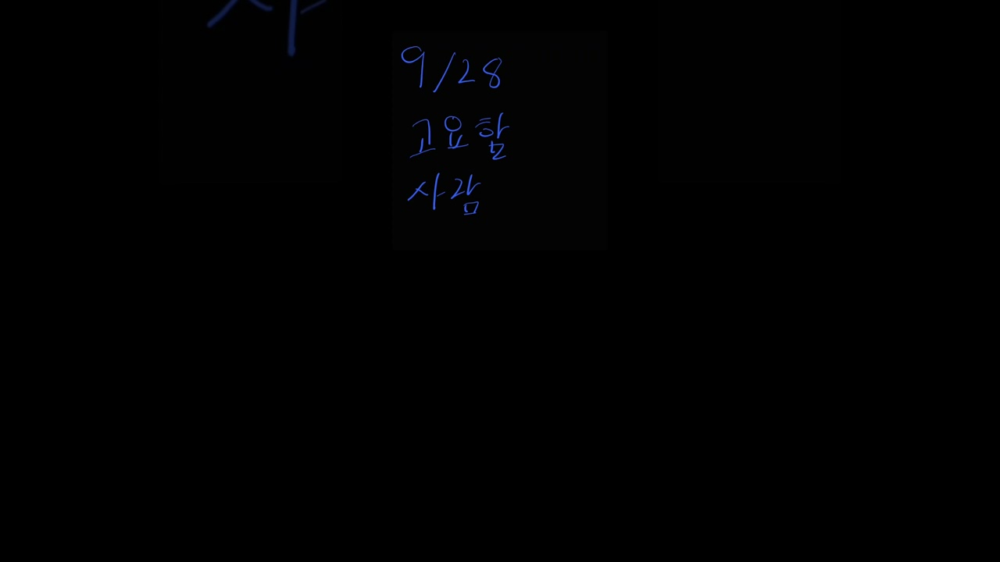

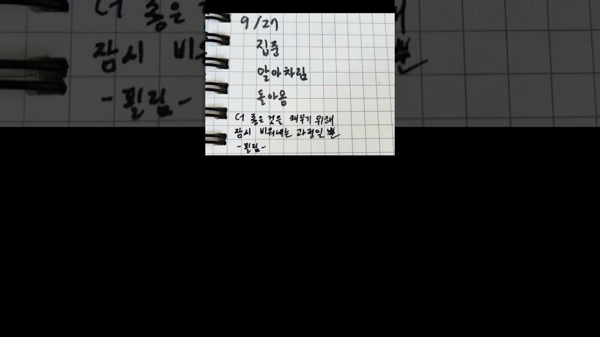

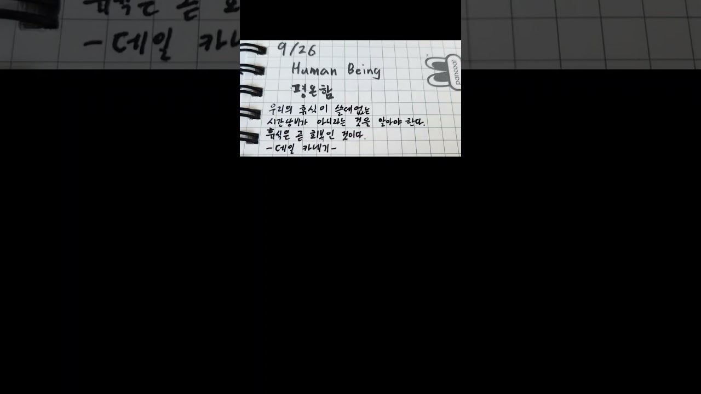

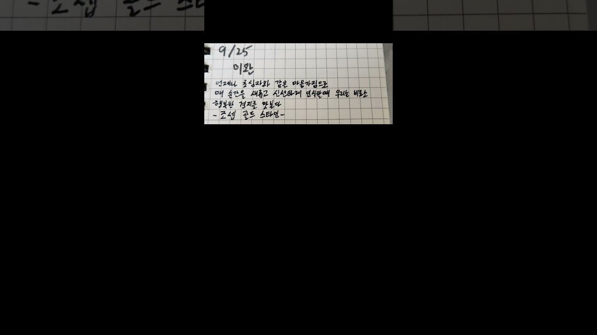

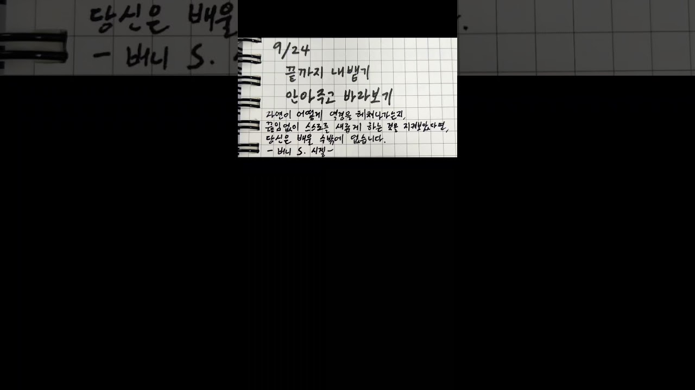

### [2025-10-13T13:33:48.261000+00:00] pappasco
100325금
https://youtube.com/shorts/uvUdnQHKS6k?si=sHr1H8Q0BUAtCrVM
Sion(시온) 'On Your Side'
함께 있는 사람. 행복.

100225목
https://youtube.com/shorts/GztLtN6p5A4?si=PX2fUm_wrFJdB_TQ
이승윤 'Canon'
고향 대구왔다. 예전에 오던 투썸. 오랫만이야.

100125수
https://youtube.com/shorts/dzMoyI_Bu1o?si=6XfUfLJ6CL40ZB4n
범진 '인사'
길거리 매머드커피서 나오는 노래. 10월에 들어왔으니 인사.

093025화
https://youtube.com/shorts/EfxlvZVaZoI?feature=shared
이선희 '달려라 하늬'
새로나온 극장판 시사회를 가봤다.  추억이다.

092925월
https://youtube.com/shorts/oD82SjnWb90?feature=shared
Red Hot Chili Peppers  'Can't Stop'
멈추고 싶지 않다 계속 가자
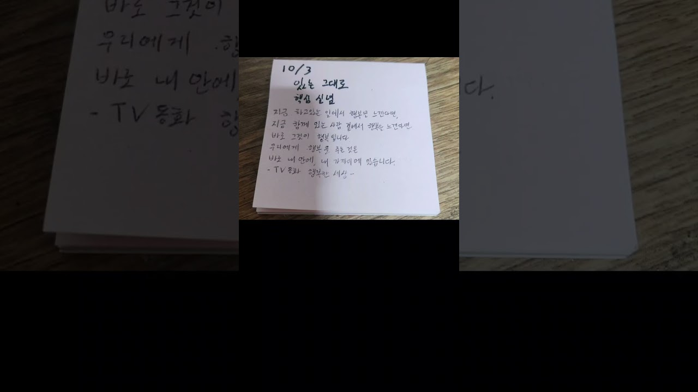

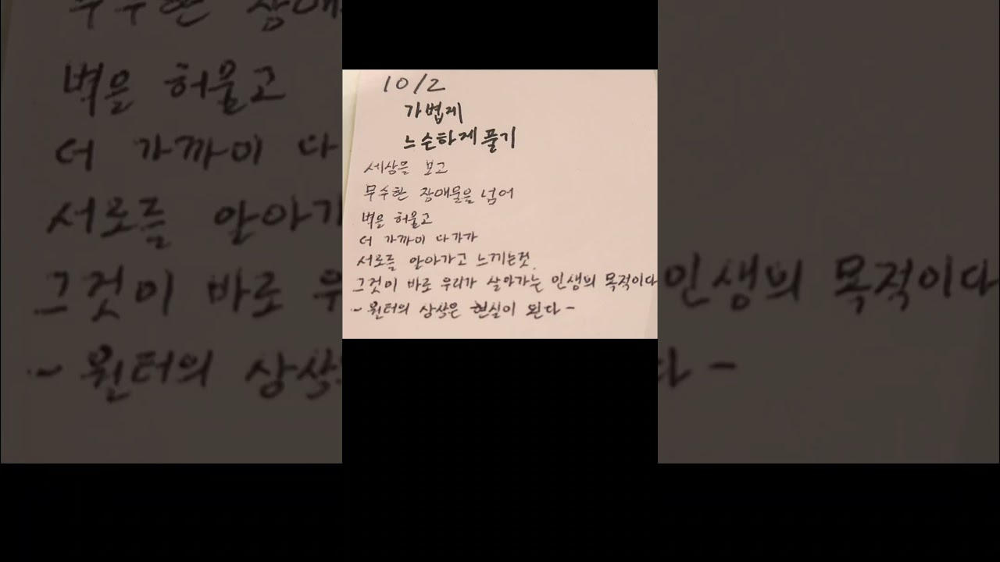

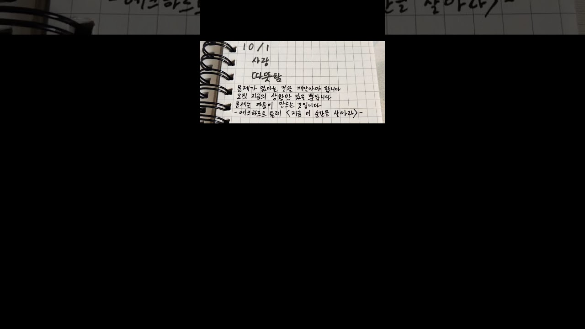

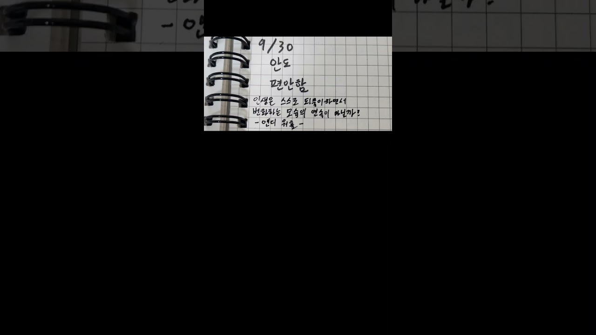

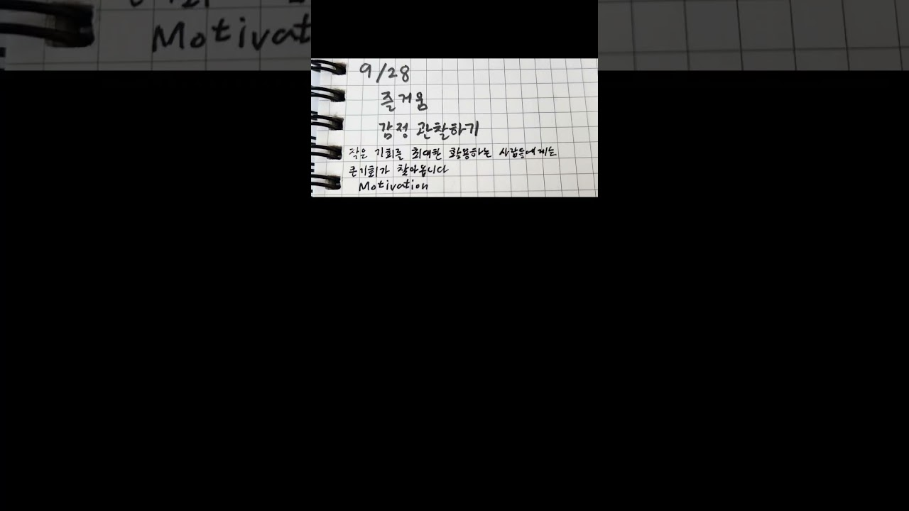

### [2025-10-13T13:34:13.087000+00:00] pappasco
101125토
https://youtube.com/shorts/Do_g924j9co?si=W_GAnfSWoYaQrP_2
조용필 '찰나'
티비를 틀면 나오는 조용필. 시간날때 봐야지.

100925목
https://youtube.com/shorts/7RRtZ_eGu-w?si=e2lFeq26oDHmdl6C
원필 '행운을 빌어줘'
행복 운 모두가 함께하길

100625월
https://youtube.com/shorts/OevRwohaHZc?si=oG6MQE-zVBYXJrxp
엔믹스 'O.O Part 2'
누나 추천곡.
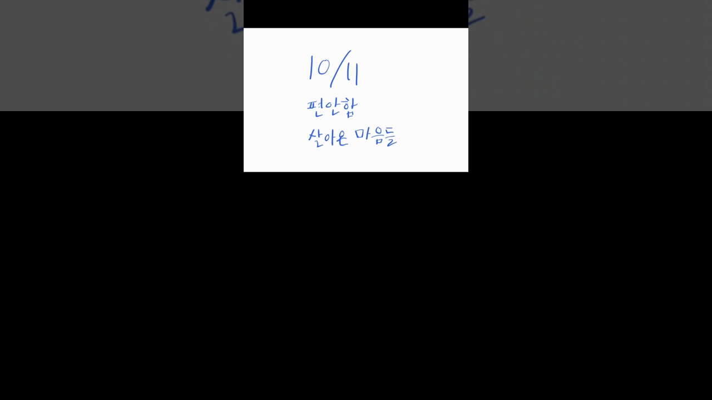

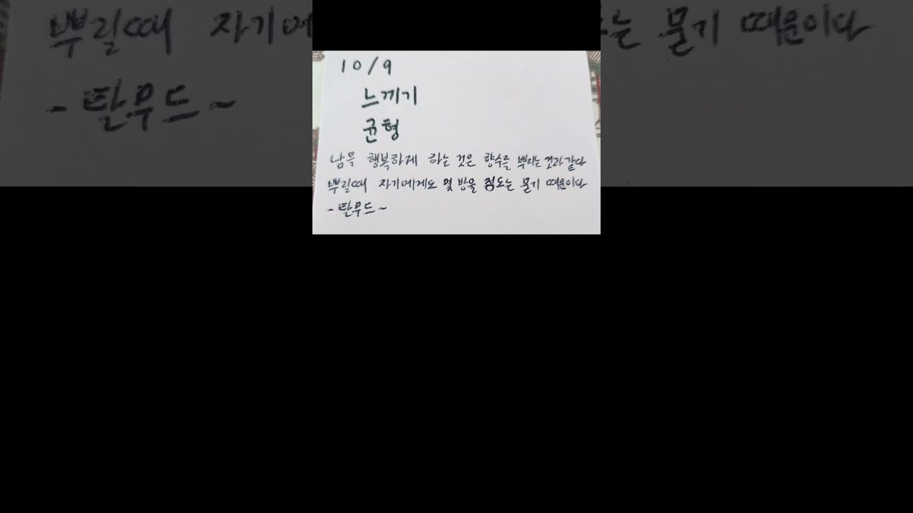

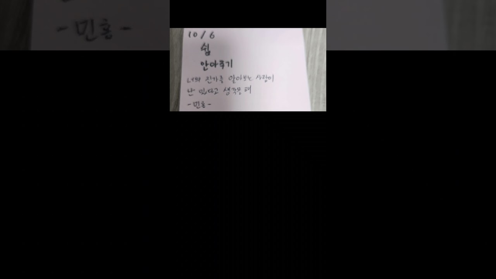

### [2025-11-05T07:44:01.006000+00:00] pappasco
251030목
https://youtube.com/shorts/LOzulfpNqDw?si=7uGyFDAUqtlM64ZJ
A*Teens  'Upside Down'
추억돋는 노래. 인생도 이렇게 밝고 풍요롭길.

251029수
https://youtube.com/shorts/jKxz0feCKTw?si=tEk2ZVee6WsI0r9m
윤마치 '초록'
시원하다. 생각외로 어럽다던 초승의 코멘트 생각남.

251028화
https://youtube.com/shorts/ryRuQqySTKI?si=TUSM06moBfUK6oRQ
악동뮤지션 '200%'
영상 제작법을 바꿨다. 블로 광고가 많네. 기본앱 쓰자.

251026일
https://youtube.com/shorts/3EAVmgdOSUw?si=CIC4OaO9you2MGPL
검정치마 'ling ling'
조정갈 준비하면서 들음. 익숙한 새벽기온 노래.

102425금
https://youtube.com/shorts/B3WTMim8E2A?si=Uu7Uje6W9wp4YNlt
일레인 '나의 시간 어딘가'
미지의서울 마지막화를 다시봤다. 슬프다.

102325목
https://youtube.com/shorts/O6zt3bhpKPY?si=92zJD4fyP-Rx4Owe
YB '너를 보내고'
이젠 놓아야할건 낙엽떨구듯 놓아주자

101825토
https://youtube.com/shorts/pMbXe6OHMdQ?si=00bi__6YVLJUaWNk
맘마미아2 삽입곡 'Dancing Queen'
시작해 춤춰봐 인생은 멋진거야. 다은이 결본식가는중. 신난다.

101425화
https://youtube.com/shorts/kKebQ5d5rOc?si=aGEr2x0OnJn_RLpc
LAVEEN(라빈), TAEBIN(태빈) '오늘 난 말야'
친구 차에서 들었던 노래. 느낌있네.

101325월
https://youtube.com/shorts/58lYhj9Moas?si=gsPgBf_Tk-dXPAfO
DAY6 '하늘 위에서'
일상으로 돌아왔다. 다시 가보자.
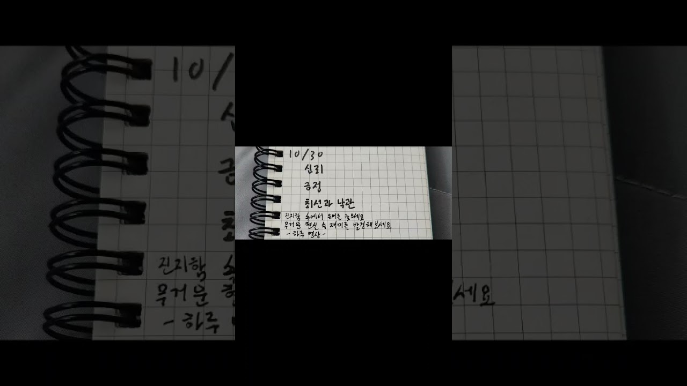

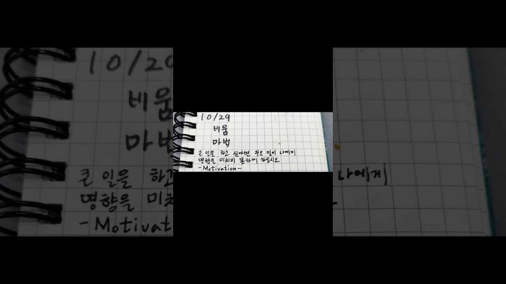

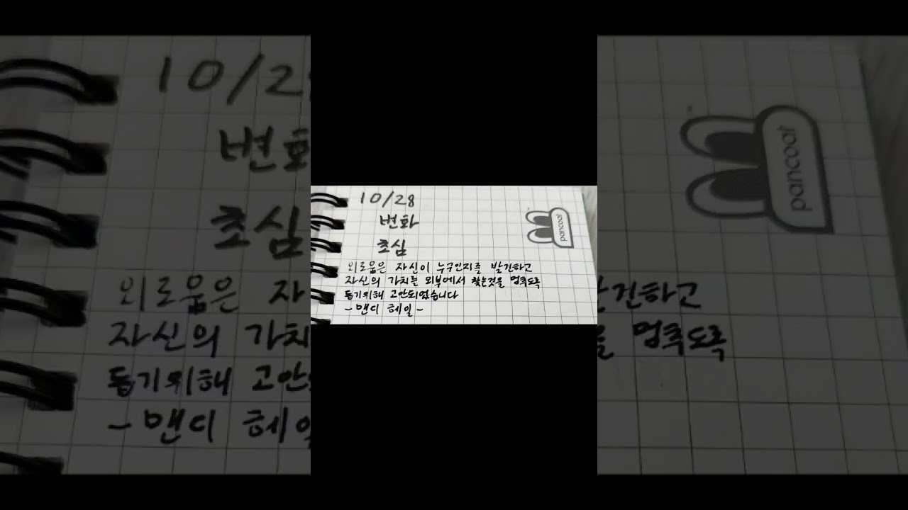

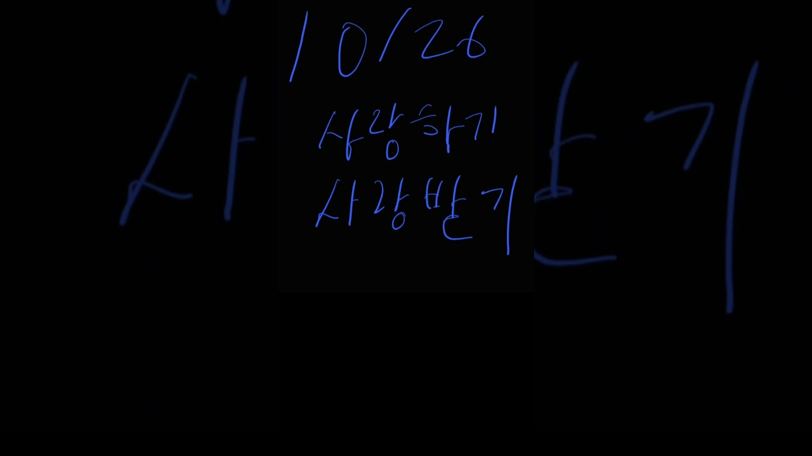

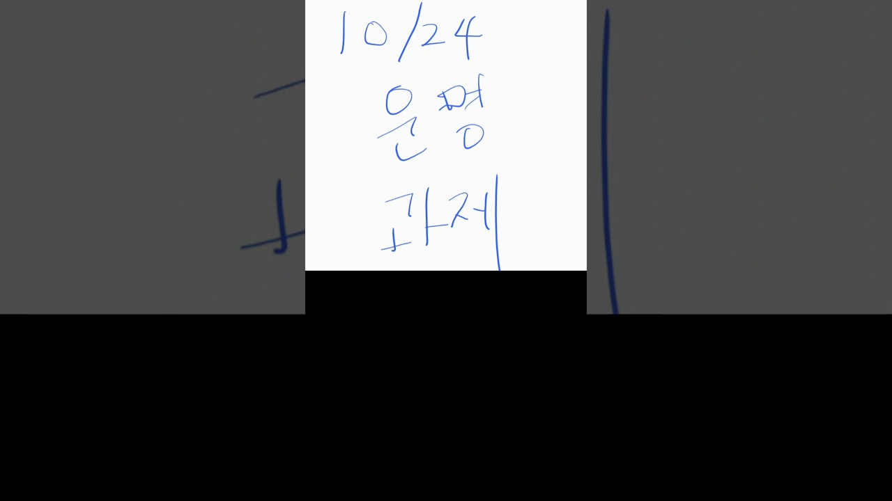

### [2025-11-10T05:21:22.276000+00:00] pappasco
251108토
https://youtube.com/shorts/kkN1xtb6QfQ?si=vaXKt7lCaobsh7Ea
015b  '아주 오래된 연인들'
신난다. 요즘 스포티파이에서 공일오비가 꽤 들림.

251106목
https://youtube.com/shorts/SsP6mrbpJtM?si=3oE6qWg4zDAjUz8r
bbh '말하고 싶어도'
명지 추천곡. 옛감성 물씬남.

251105수
https://youtube.com/shorts/c3Vjv01Yxw4?si=XcmZxABxbHM0swz8
m-flo loves melody. & Ryohei / miss you
추억이다. 여유 느낌. 요즘 열심히 산다고 정신없는데 한숨돌림.
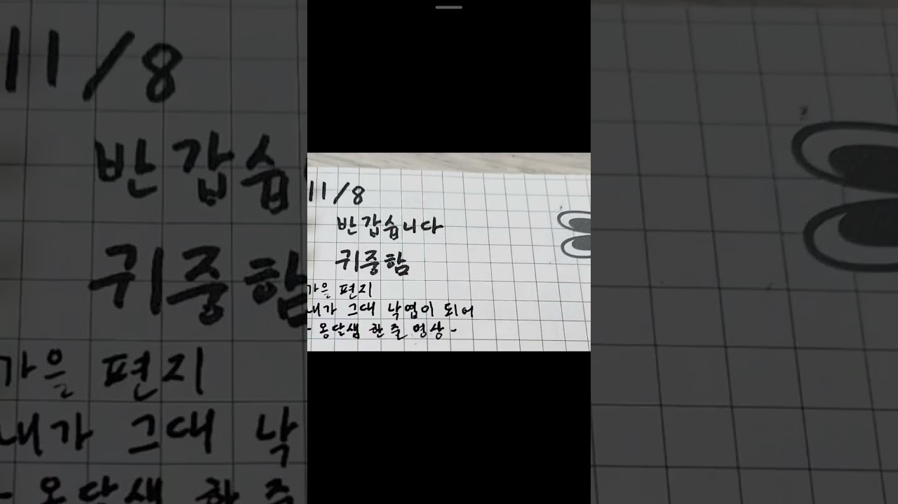

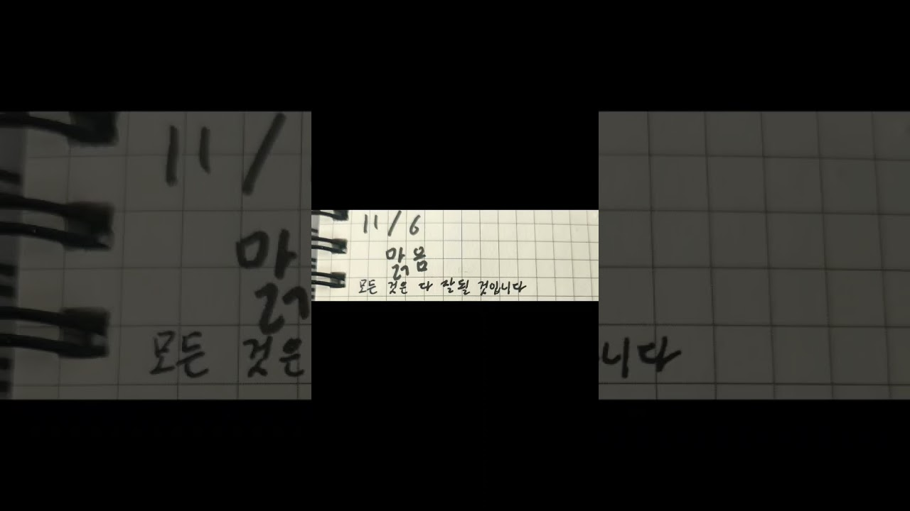

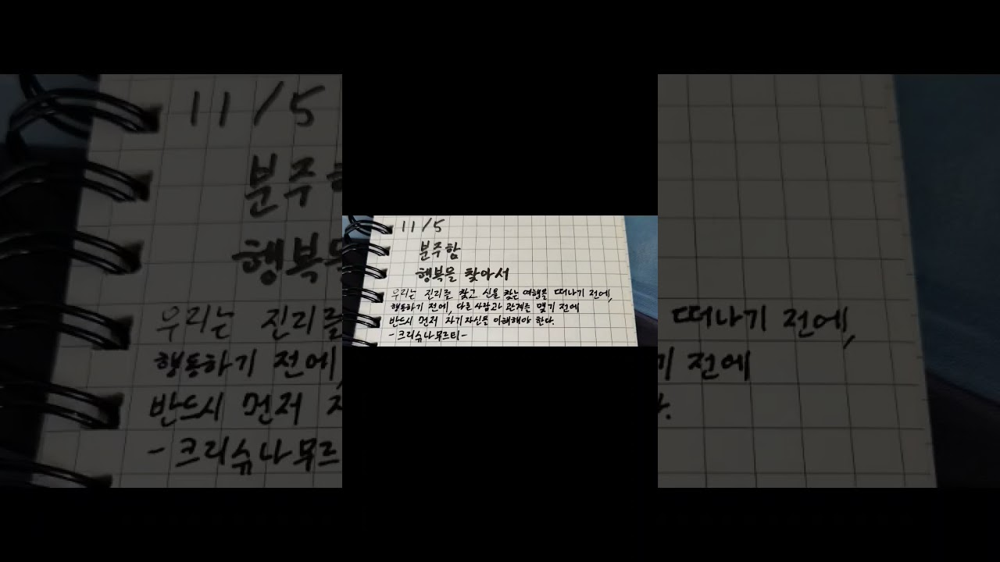

### [2025-11-15T21:59:49.441000+00:00] pappasco
251116일
https://youtube.com/shorts/Z1BP7Azh81o?si=dGbIfFxicXynQipE
ノスタルジックレインフォール/CHICO with HoneyWorks
허니웍스 노래가 꽤 좋다. 힘이 나는 군.

251114금
https://youtube.com/shorts/nJP5wiGmfLQ?si=xPvJPboCPnM-cKjA
god '촛불 하나'
빛을 비춘다면 이노래 아닐까

251113목
https://youtube.com/shorts/AEQJ04DjN2s?si=XV603RYByFosjAok
yb '나는 나비'
수능이다. 세상을 자유롭게 날아라.

251110월
https://youtube.com/shorts/V-7g2q5nFwA?si=USWZEFHx1dBEHaL0
Sacrifice - G.E.M
롤드컵을 봤다. 페이커 대단하네
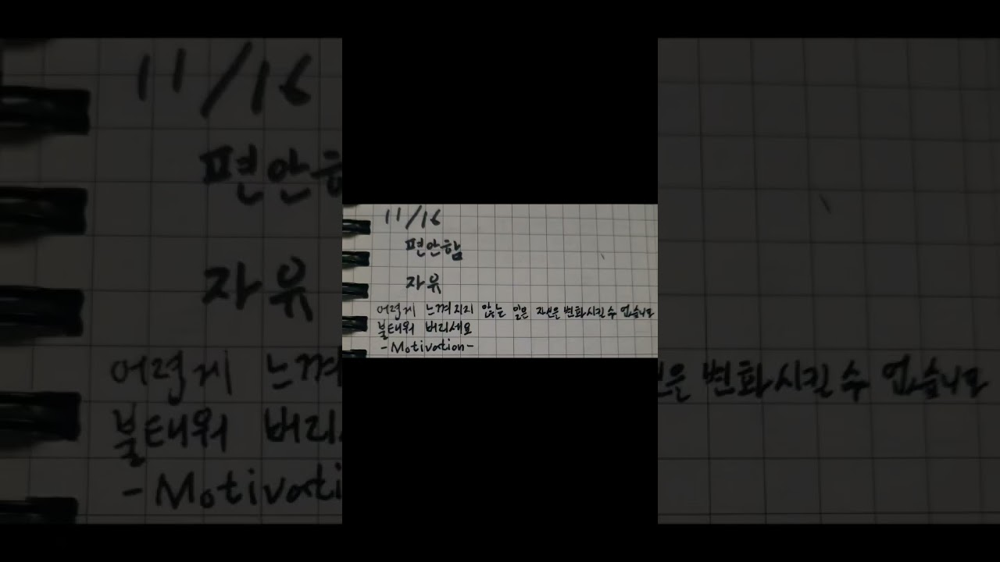

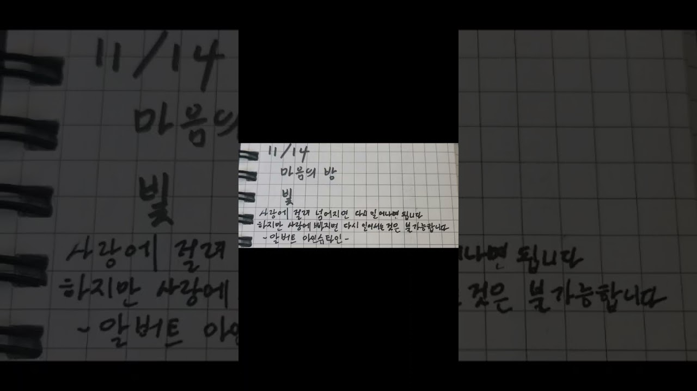

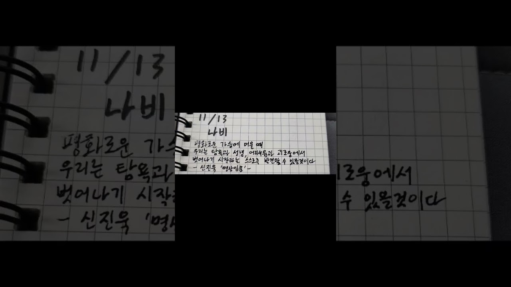

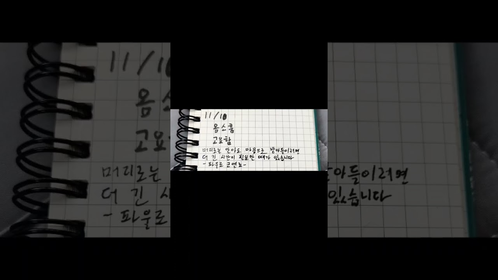
