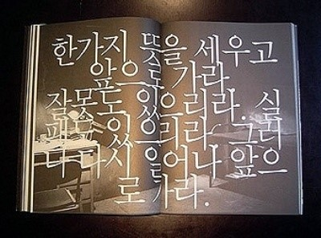
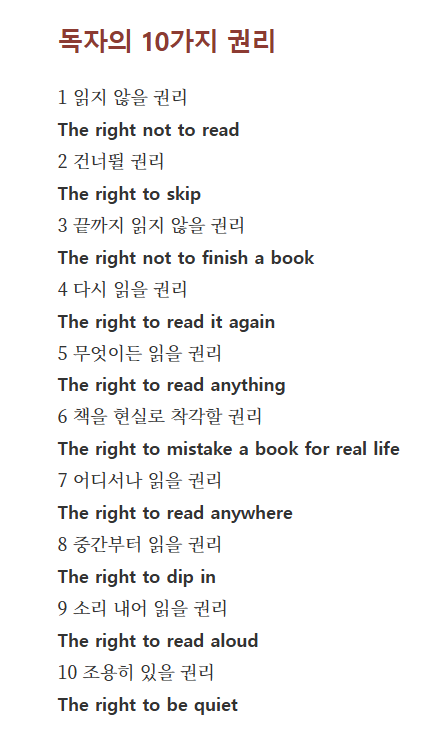

# rules

### [2025-07-04T02:35:48.668000+00:00] pappasco
책.숨(책 속에 숨겨진 나를 만나다) 
책과 삶에 대해 숨쉬는 공간입니다.

### [2025-07-07T09:17:09.234000+00:00] pappasco
*(텍스트 없음)*

### [2025-09-11T07:21:12.855000+00:00] pappasco
<침해할 수 없는 독자의 권리>

무엇을 어떻게 읽든…

1. 책을 읽지 않을 권리
2. 건너뛰며 읽을 권리
3. 책을 끝까지 읽지 않을 권리
4. 책을 다시 읽을 권리
5. 아무 책이나 읽을 권리
6. 보바리즘을 누릴 권리
7. 아무 데서나 읽을 권리
8. 군데군데 골라 읽을 권리
9. 소리 내서 읽을 권리
10. 읽고 나서 아무 말도 하지 않을 권리

― 다니엘 페나크 『소설처럼』 중에서

### [2025-09-11T07:38:57.986000+00:00] pappasco
*(텍스트 없음)*
