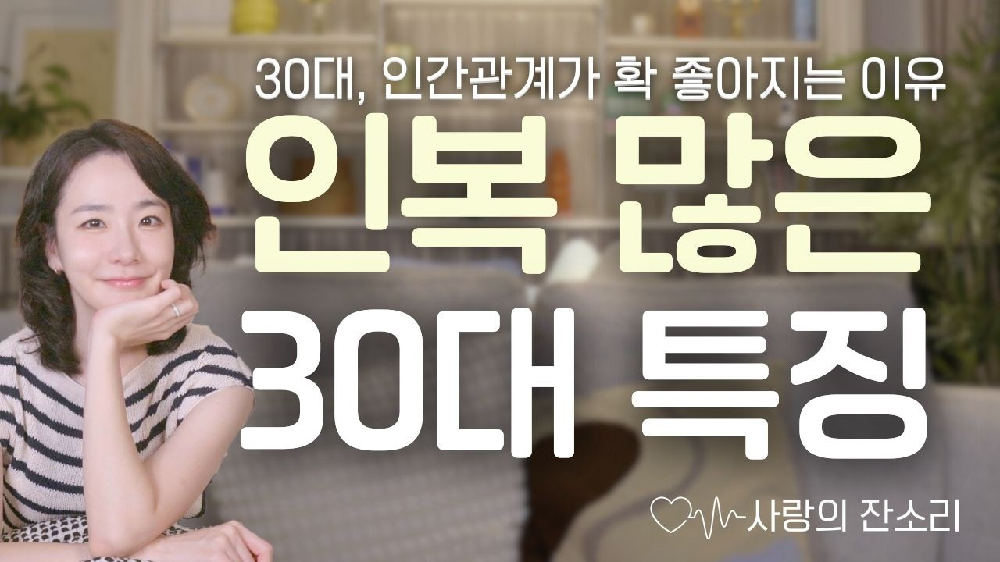

# 생각하는/30대, 인간 관계가 확 좋아지는 사람들의 특징 3가지

### [2025-08-30T05:47:20.197000+00:00] pappasco
https://youtu.be/sXrTojj7fzE

1.필요한 사람
-능력과 매력으로 사람들이 먼저 찾게 만든다.
2.돕는 사람
-먼저 주되, 도울 대상을 현명하게 선택한다.
3.행복 관리틀 하는 사람
-에너지를 지키고, 무리 없이 관계를 지속한다.

