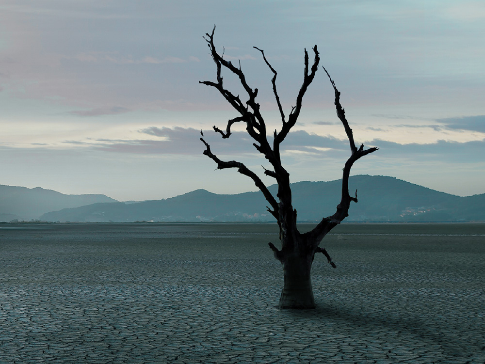

# 생각하는/고통의 총량은 변하지 않는다

### [2026-07-13T16:03:28.051000+00:00] pappasco
https://www.kyobo.com/dgt/web/kbstory/contents/detail/1879

벌거벗고 서서 바람을 맞이 하고 태양의 녹아 드는 것 
이것이야말로. 죽음이 아니겠는가 
흙이 팔다리를 가져가고 나서야 
우리는 비로소 진정한 춤을추리라 
칼릴 지브란.
