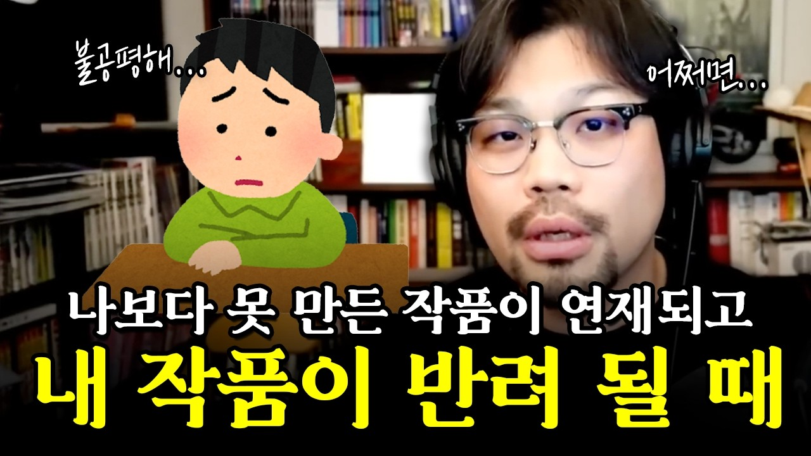

# 생각하는/나보다 못 만든 작품이 연재되는 불합리한 시장, 계속 도전하는 게 맞을까요?

### [2026-03-18T07:28:49.491000+00:00] pappasco
https://youtu.be/gJe_3KH0BzY

우직하다, 미련하다 구분되는것 - 세상의 흐름에 맞는 내가되었는가
나만의 분노 방향을 적절히 향하기
분노가 어디로 향하는지 알게 되면 분노가 정련되고 분노가 사라지기도 하고
분노가 정련되면 꽤나 생산성이 올라감
사람이라는 구멍으로 새어나가줘야
소수의 독자가 찾고 있는 작품을 원한걸수도 있다. - 그 결과를 의도한 것일수 있다. 내가 생각한 방향이 아닌쪽으로 나아가는게 맞는것일수 있다.

