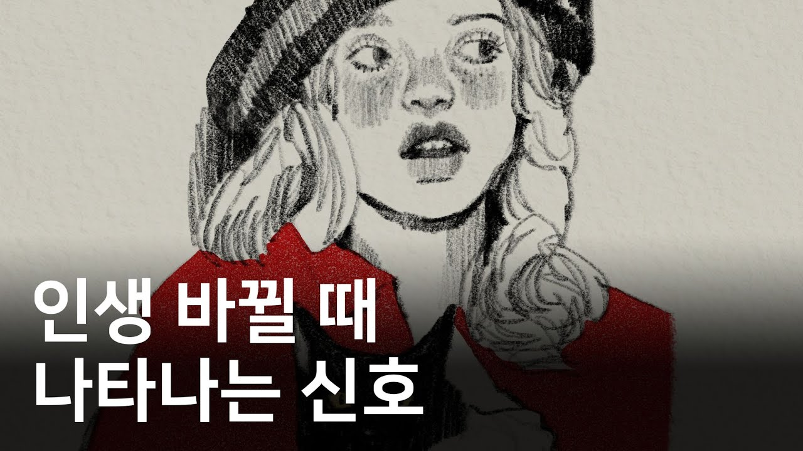

# 생각하는/인생에서 놓쳐선 안 되는 시그널

### [2026-02-27T07:07:07.431000+00:00] pappasco
https://youtu.be/t4e9kIBqJLA?si=1f7ShE6QqPPZcfic
관계의 변화 - 새로운 사람과 연결되면서 확장.
직관 강해짐 - 촉대로 열심히 노 젓기
목표의 변경 - 풍성한 삶

너무 불안 - 심리 상담센터 방문, 수면, 운동
무기력함 - 작은 시도 작은 성공하기. 정리정돈, 잘 씻기-우울은수용성,
나쁜 습관 -  식습관 알기

### [2026-02-27T07:15:54.018000+00:00] pappasco
삶은 파도. 준비와 대비 하기.